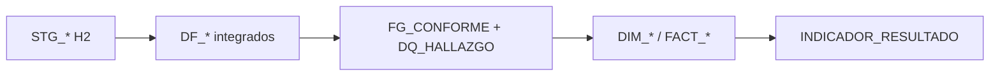

# Cuarentena blanda auditable

**En una línea:** depurar sin borrar, auditar cada corrida, publicar hechos completos con trazabilidad de defectos.

## Cuándo aplicar

| Pregunta | Si sí → |
|---|---|
| ¿Los defectos son hallazgo entregable? | Cuarentena blanda |
| ¿Hay que defender cifras ante un tercero? | `DQ_HALLAZGO` materializado |
| ¿Varias fuentes sin llave única? | `QA_AMARRE` + KPI de amarre (K5), no INNER JOIN forzado |

Si solo hay que limpiar datos y nadie audita → ETL clásico con rechazo es más simple.

## Capas en este arquetipo (Python + Oracle)

| Capa | Qué garantiza |
|---|---|
| `STG_*` | Copia 1:1, efímera, VARCHAR tolerante |
| `DF_*` | Integración + homologación tipada |
| `FG_CONFORME` | Marca S/N por fila; **no filtra** |
| `DQ_HALLAZGO` | Bitácora por regla, registro, campo |
| `FACT_*` | Carga **todas** las filas; defectos también van al hecho |
| `INDICADOR_RESULTADO` | K5 reporta % conforme y % amarre |

## Reglas de calidad (plantilla R01–R05)

Adaptar descripciones al dominio; mantener códigos estables para K5:

1. **R01** — Completitud campos clave
2. **R02** — Formato identificadores (CUM/CAM, etc.)
3. **R03** — Coherencia temporal
4. **R04** — Montos no negativos
5. **R05** — Coherencia cruzada (ej. UIT × valor = soles)

Implementación: `aplicar_calidad()` devuelve dataframes **sin drop** + lista/`DataFrame` de hallazgos.

## QA_AMARRE (fuentes sin llave conformada)

- Comparar conjuntos de claves candidatas (expediente, CUM, COD_PROY_MC…).
- Campos: `PUENTE`, `N_IZQ`, `N_DER`, `N_MATCH`, `PCT_MATCH_IZQ`.
- **No** usar match bajo como filtro de carga; solo diagnóstico + K5.

## Invariantes a loguear (no bloqueantes)

- `sum(K1 por grano) = COUNT(hecho)` si cada fila cae en un bucket.
- `COUNT(DQ_HALLAZGO)` coherente con no conformes (puede haber múltiples reglas por registro).
- Segunda corrida mismo insumo → mismos conteos y KPIs.

## Anti-patrones

- Descartar filas no conformes antes del hecho (destruye evidencia).
- INNER JOIN multas↔informes por expediente cuando el amarre es parcial.
- Append VARCHAR genérico a Oracle para tablas con DDL formal.
- `aggregate()` en R/pandas que pierde grupos con NA en claves (usar groupby explícito).

## Git

Una rama por **fase de servicio** del contrato (fase-1, fase-2, fase-3), no carpetas por fase en el repo.

## Referencia en código

- `logica/dwh/calidad.py` — reglas y `QA_AMARRE`
- `logica/dwh/indicadores.py` — K5 `PCT_CONFORME`, `PCT_AMARRE`
- `docs/lineamientos/ddl/03_bitacora.sql` — `DQ_HALLAZGO`
