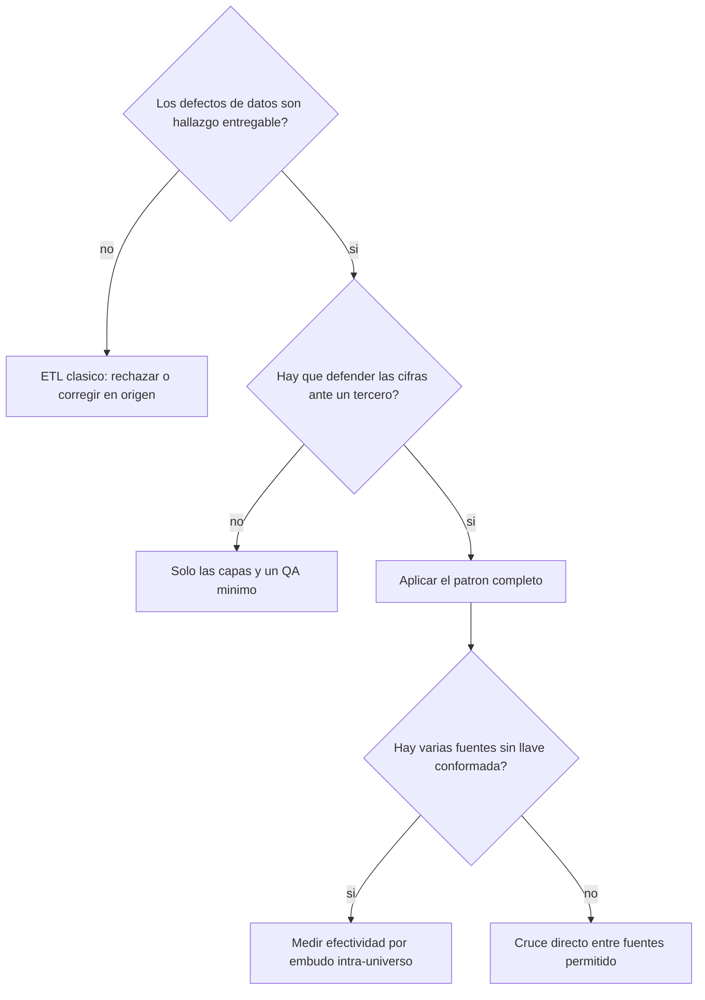
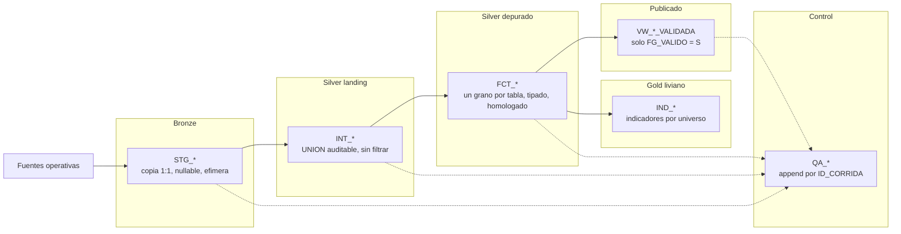
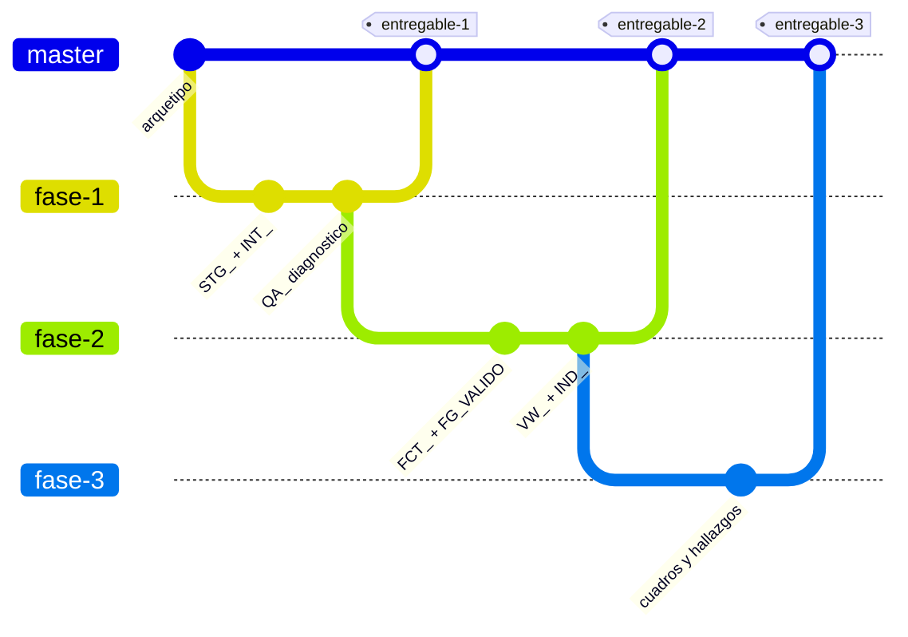
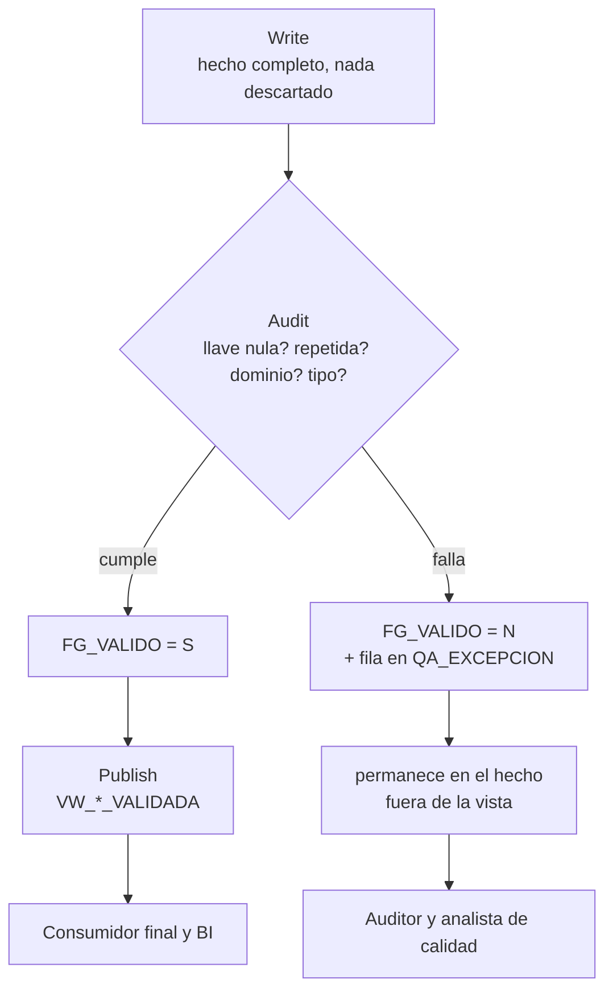
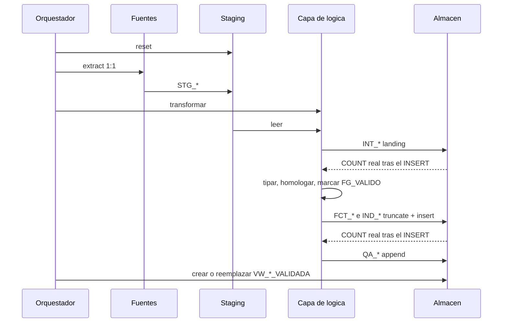
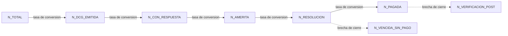
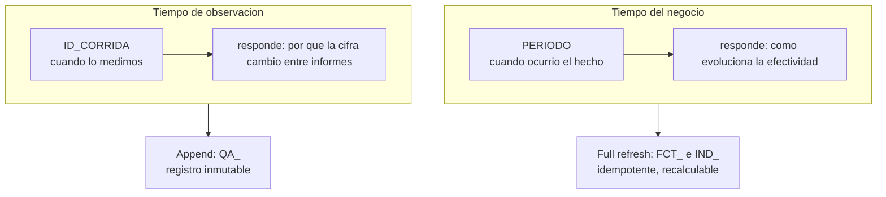

# Medallion auditable con cuarentena blanda

**En una línea:** depurar sin borrar, auditar cada corrida, publicar solo lo validado.

Patrón del proyecto para los literales **d** (depurar y estandarizar), **e**
(trazabilidad entre fuentes originales, consolidadas, depuradas y finales validadas) y
**f** (evaluar efectividad) del TDR REQ 3629-2026.

## Cuándo aplicarlo

No es un patrón de propósito general: está diseñado para consultorías y auditorías de
datos, donde el defecto **es** parte del entregable y las cifras se defienden ante un
tercero.



Si los datos malos solo hay que arreglarlos y nadie va a auditar el proceso, un ETL
clásico con rechazo es más simple y más barato.

## Los tres patrones que se combinan

| Patrón | Origen | Qué aporta aquí |
|---|---|---|
| **Medallion** | Lakehouse / Databricks, nomenclatura de dbt | Capas con garantías distintas y crecientes |
| **Write-Audit-Publish** | Ingeniería de datos moderna | El consumidor final nunca ve datos sin auditar |
| **Accumulating snapshot** | Kimball | Mide efectividad de un proceso por hitos, sin cruzar fuentes |

Lo que le da identidad propia no es ninguno de los tres, sino la **inversión de la
cuarentena**: en un ETL comercial el registro defectuoso se descarta o se aparta; acá
se queda en el hecho, marcado, porque borrarlo destruiría la evidencia que hay que
reportar.

## Capas



| Capa | Prefijo | Garantía | Carga |
|---|---|---|---|
| Bronze | `STG_` | Copia fiel de la fuente, sin reglas | Efímera, se resetea |
| Silver landing | `INT_` | Todo lo que llegó, **nunca filtrado** | Full refresh |
| Silver depurado | `FCT_` | Un grano, tipos correctos, dominios homologados | Full refresh |
| Publicado | `VW_` | Sin llaves nulas ni repetidas | Vista, sin carga |
| Gold liviano | `IND_` | Agregados por universo, sin cruzar fuentes | Full refresh |
| Control | `QA_` | Una fila por corrida y hallazgo | **Append** |

Prefijos tomados de la convención de dbt (`stg` / `int` / `fct`). `INT_` es
*intermediate*, no "interno". Evitar `RPT_` para el landing: sugiere reporte y confunde
la capa.

La regla que sostiene todo: **el landing no se filtra nunca**. Si se sobrescribe o se
depura la capa `INT_`, se pierde la capacidad de demostrar qué entregó la fuente, y con
ella la trazabilidad completa.

### Cómo encaja en este arquetipo

| Capa | Dónde vive acá |
|---|---|
| `STG_` | H2 `mem:csep`, creada por `python/create_stg.py` desde `inputs.yaml`, cargada por pipelines Hop |
| `INT_` / `FCT_` / `IND_` / `QA_` | Destino final (MySQL o Excel), escritas desde `r/io/` |
| Lógica de capas | El único `.py` de `python/logica/` de la rama de la fase |

## Fases: una rama por fase, no una carpeta

Cada fase del servicio vive en **su propia rama git**. No hay `docs/fase2/`,
`python/logica/fase2/` ni `sql/fase2/`: el árbol de archivos es el mismo en todas las fases y
lo que cambia es la rama.

| Rama | Entregable | Actividades del TDR | Qué agrega al medallion |
|---|---|---|---|
| `fase-1` | Primero | a) consolidar, b) revisar estructura, c) validar completitud y consistencia | `STG_`, `INT_`, y `QA_CORRIDA` / `QA_EXCEPCION` de diagnóstico |
| `fase-2` | Segundo | d) depurar y estandarizar, e) trazabilidad entre capas, f) analizar efectividad | `FCT_`, `VW_*_VALIDADA`, `QA_COBERTURA_PUENTE`, `IND_` |
| `fase-3` | Tercero | g) cuadros y gráficos, h) hallazgos | Ninguna capa nueva: consume `VW_*_VALIDADA` e `IND_` y escribe a `output/` |

La fase 1 **no depura**: consolida y mide el daño. Marcar `FG_VALIDO` y publicar
`VW_*_VALIDADA` es trabajo de la fase 2. Si la fase 1 empieza a limpiar, el entregable
pierde el diagnóstico que justifica la fase 2.



### Por qué ramas y no carpetas

**El arquetipo admite un solo `.py` de lógica.** `python/main.py` auto-descubre el único
archivo de `python/logica/` y falla con 0 o con más de 1, y el listado no es recursivo. Con
carpetas por fase hay que meter un `import`/`exec` de `python/logica/faseN/*.py` dentro de ese
único archivo, y la fase vieja queda enganchada al camino de ejecución de la nueva. Con
una rama por fase, cada fase tiene su único `.py` y no hace falta el andamiaje.

**El entregable se defiende con el código de ese momento.** `git checkout fase-1`
reproduce las cifras del primer informe tal como se presentaron. Si las fases conviven
en carpetas dentro de la misma rama, el código de la fase 1 sigue mutando con cada
cambio de la fase 2 y las cifras entregadas dejan de ser reproducibles. Es la misma
razón por la que las `QA_*` van en append: el tiempo de la observación es un eje, y hay
que poder volver a él.

### Reglas de rama

1. `fase-1` sale de la rama base (`master` acá, por el default de git 2.43). `fase-2`
   sale de **`fase-1`**, no de la base: la fase 2 depura lo que la fase 1 consolidó.
   Igual `fase-3` desde `fase-2`.
2. Al aprobarse el entregable: tag (`entregable-1`) y merge a `master`. **La rama no se
   borra**, es el respaldo del informe.
3. **No hacer backport de reglas de negocio a una fase cerrada.** Cambiaría cifras ya
   conformadas ante DPEF. Si la fase 1 tenía un error real, se corrige en la fase
   siguiente y se reporta como hallazgo, no se reescribe la historia.
4. Sí se propaga hacia atrás la **infraestructura** (scripts de H2, conexiones, fixes de
   workflow), nunca las reglas de datos.
5. Un solo `.py` en `python/logica/` por rama.
6. Atar la corrida al código: registrar el commit corto y la rama en
   `QA_CORRIDA.DETALLE`. Sin eso, un `ID_CORRIDA` no dice con qué reglas se calculó.

Antes del primer commit: `project-config.json` y `environments/*.json` llevan passwords
en texto plano y **no** están en `.gitignore`. Dejarlos con placeholders `<...>` o
ignorarlos antes de publicar la rama.

## Write-Audit-Publish con cuarentena blanda



Tres reglas de implementación:

**Marcar, no borrar.** El defecto se registra en dos lugares: un flag en la fila
(`FG_VALIDO`) y una fila de detalle en la tabla de excepciones. El flag permite filtrar
sin joins; la excepción permite explicar el porqué.

**En duplicados, marcar solo las repeticiones.** Marcar todas las ocurrencias de una
llave repetida vaciaría la entidad de la base validada. Marcando solo la segunda y
siguientes, la base publicada queda con una fila por llave sin perder ninguna entidad.

**Los controles avisan, no abortan.** Equivalente al `severity: warn` de dbt frente a
`error`. En una fase de diagnóstico las fallas de calidad son el objeto de estudio: un
pipeline que se cae ante el primer duplicado no entrega nada.

## Tablas de control mínimas

```sql
-- Una fila por corrida, capa y fuente. Carga APPEND.
QA_CORRIDA (
  ID_CORRIDA, FECHA_CORRIDA, CAPA, FUENTE, TABLA,
  N_FILAS, N_LLAVE_NULA, N_DUPLICADO_LLAVE, CHECK_STS, DETALLE
)
-- CAPA: STG / INT / DESTINO / FCT / VALIDADA
-- CHECK_STS: OK / WARN

-- Un hallazgo por fila. Carga APPEND.
QA_EXCEPCION (
  ID_CORRIDA, FECHA_CORRIDA, TABLA, FUENTE, TIPO, LLAVE, DETALLE
)
-- TIPO: LLAVE_NULA / DUPLICADO_LLAVE / FUERA_DE_DOMINIO /
--       FECHA_NO_PARSEABLE / MONTO_NO_PARSEABLE / VALOR_NEGATIVO

-- Cobertura de puentes candidatos entre fuentes. Diagnostico, no hecho.
QA_COBERTURA_PUENTE (
  ID_CORRIDA, FECHA_CORRIDA, PUENTE, N_IZQ, N_DER, N_MATCH, PCT_MATCH, NOTA
)
```

`PCT_MATCH` se calcula sobre valores **distintos** del lado izquierdo, no sobre filas.

## Trazabilidad: conteos por capa y lectura de vuelta



El paso que suele faltar es el **COUNT leído de vuelta**. Contar el data.frame en
memoria no prueba nada sobre la base: un `INSERT` parcial, un trigger o un tipo
incompatible pueden dejar menos filas de las que se enviaron. El único control que
detecta eso es consultar `COUNT(*)` después de escribir y compararlo con lo esperado.

Las `QA_*` se escriben **al final**, después de cargar `FCT_` e `IND_`, para que puedan
registrar el conteo real de las tablas que se acaban de cargar.

## Efectividad: accumulating snapshot y conteo de hitos

Cuando hay que medir la efectividad de un proceso pero **no existe una llave conformada**
entre las fuentes, forzar el join equivale a inventar una equivalencia que nadie
declaró. La alternativa correcta es medir dentro de cada universo.

El hecho se modela como **accumulating snapshot**: una fila por instancia del proceso,
con una columna por hito, que se van llenando conforme avanza.



La propiedad que lo hace defendible: **todos los hitos se cuentan sobre el mismo
conjunto de filas**. Ningún número depende de un supuesto de cruce, así que el
indicador se sostiene aunque el puente entre fuentes siga sin resolverse.

El cruce imposible no se oculta: se reporta como cobertura medida en una tabla aparte
(`QA_COBERTURA_PUENTE`), y el hallazgo "no hay llave conformada" pasa a ser parte del
análisis en lugar de un problema técnico escondido.

Con las fechas tipadas, el mismo modelo habilita **cycle time** entre hitos: no solo
cuántos expedientes pasan cada tramo, sino cuántos días tardan.

## Dos ejes temporales

Confundirlos es el error más común al implementar el patrón.



De ahí la asimetría de carga: los hechos e indicadores se recalculan completos porque
su eje es el tiempo del negocio, y las tablas de control se acumulan porque su eje es
el tiempo de la observación. Una columna `PERIODO` derivada de la fecha de referencia
del grano, con un valor explícito tipo `'SIN_FECHA'` en lugar de `NULL`, da el eje del
negocio sin excluir los registros incompletos, que suelen ser parte del hallazgo.

## Invariantes que hay que verificar

Estas comprobaciones son las que hacen el patrón auditable. Sin ellas, las capas son
solo nombres de tablas.

| Invariante | Qué detecta |
|---|---|
| `COUNT` por capa: fuente, landing, hecho | Pérdida silenciosa de filas en una transformación |
| `COUNT(*)` real leído tras cada `INSERT` | Carga parcial en el almacén |
| `SUM` de cada indicador = `COUNT` de su hecho | Grupos perdidos al agregar |
| Filas marcadas + filas válidas = total del hecho | Marcado incoherente |
| Orden de columnas del código = orden del `CREATE TABLE` | Escritura desplazada cuando el driver inserta por posición |
| Unicidad del grano declarado, incluido el compuesto | Grano violado, que invalida todo conteo |

**Dos trampas que hay que buscar activamente:**

Varios drivers insertan **por posición y no por nombre** (`INSERT` sin lista de
columnas, o `executemany` mal alineado). Agregar una columna en el código sin ponerla
en la misma posición del DDL escribe datos en la columna equivocada **sin lanzar ningún
error**. Conviene una prueba automática que compare ambos órdenes.

Las funciones de agregación suelen **descartar grupos con clave nula** (`aggregate` en
R, `groupby` con `dropna=True` en pandas). Si el paso de depuración acaba de convertir
`""` y los valores centinela en nulos, el indicador subcuenta en silencio. Colapsar las
claves de agrupación a un literal explícito (`'VACIO'`) antes de agrupar, y verificar
que la suma cuadre con el hecho.

## Verificación sin datos

En consultoría el acceso a los datos reales suele llegar tarde. Escribir una batería de
invariantes sobre **datos sintéticos**, sin base de datos, que corra en segundos.

El caso de prueba debe incluir a propósito los defectos que el patrón promete manejar:
llave nula, llave duplicada, grano compuesto repetido, valores centinela (`#N/A`, `-`,
`NULL` como texto), montos no numéricos, montos negativos, fechas ausentes y fechas en
formato inesperado.

## Antipatrones

**Truncar las tablas de control en cada corrida.** Destruye el histórico, que es
justamente lo que sustenta la trazabilidad. Van en append con `ID_CORRIDA`.

**Contadores de calidad siempre en cero.** Si una columna como `N_DUPLICADO_LLAVE`
nunca se puebla, el control da falsa confianza. Peor que no tenerla.

**Comparar dos vistas del mismo objeto en memoria.** Un check "origen vs destino" que
compare dos filtros del mismo data.frame nunca puede fallar. El contraste tiene que
cruzar un límite real: la base de datos.

**Normalizar la clave en un módulo y no en otro.** Si el control de duplicados usa la
clave en crudo y el de cobertura la usa normalizada, los dos reportan cardinalidades
distintas de la misma columna. Normalizar una vez, en la capa de depuración, y
persistir la columna normalizada.

**Filtrar por período para "limpiar".** Recortar el universo deja fuera los registros
sin fecha, que suelen ser parte del hallazgo. Derivar `PERIODO` con un valor explícito
(`'SIN_FECHA'`) y usarlo para comparar, no para excluir.

**Fases en carpetas dentro de la misma rama.** El código de la fase entregada sigue
cambiando con la fase siguiente y las cifras del informe ya presentado dejan de
reproducirse. Una rama por fase.

## Qué no es este patrón

**No es Data Vault.** Un *link* de Data Vault resolvería con elegancia la integración
de fuentes con llaves irreconciliables. Es desproporcionado cuando el volumen es de
miles de filas y el equipo es de una persona.

**No es una estrella Kimball completa.** El gold es "liviano": tablas de indicadores
agregados, no dimensiones conformadas con SCD. La homologación vive en columnas del
hecho. La estrella es el paso siguiente, cuando el modelo de negocio esté acordado.

**No reemplaza un framework de calidad.** Great Expectations o Soda implementan los
mismos controles con más rigor y mejor reporte. El patrón los escribe a mano cuando
agregar una dependencia de runtime no es viable, siguiendo el mismo checklist de
dimensiones: completitud, unicidad, validez, consistencia y exactitud.

**No es carga incremental.** Full refresh en todo salvo las tablas de control. Con
volúmenes pequeños es más simple y más seguro; con volúmenes grandes habría que
reemplazarlo por `MERGE` incremental y el patrón se mantiene igual.

## Implementación de referencia

Proyecto `multa_etl` (OEFA / CSEP), Apache Hop + H2 + R + Oracle. Fuera de este repo,
en el mismo equipo: `~/Documents/desarrollo/workspace_oefa/multa_etl`, rama `fase-2`.

- Aplicación concreta al TDR y justificación: `docs/fase2/patron_y_tecnica.md`, `docs/fase2/plan_mejora.md`
- Lógica por etapas: `r/logica/fase2/01_depurar.R` … `04_cobertura_ind.R`
- Batería de invariantes sobre datos sintéticos: `r/tests/smoke_fase2.R`

Ahí las fases están **a la vez** en ramas y en carpetas `fase2/`, y el único `.R` de
`r/logica/` termina haciendo `source` de los pasos. Esa duplicación es lo que este
arquetipo abandona: se copian las reglas y los controles, no la estructura de carpetas
ni el runtime R. Acá la zona de pegado es `python/logica/`.
