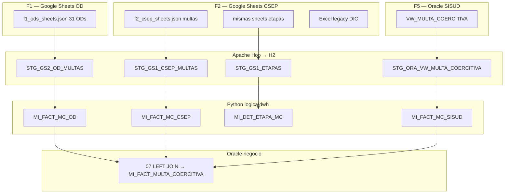
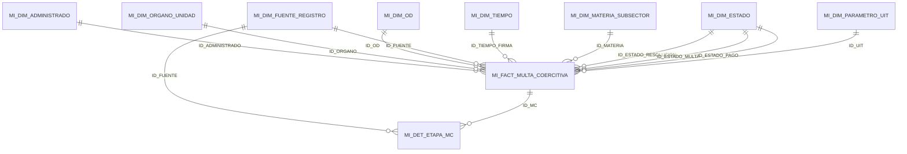
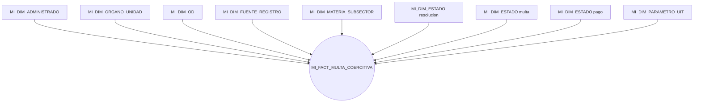

# Modelo Kimball — multas coercitivas (OEFA)

Vista general del **data warehouse** que carga el ETL (`logica/dwh/` → `cargar_dw.py`) en Oracle **BD_CURSOR**.  
Prefijo de tablas: **`MI_`**. Esquema según entorno: `APP` (local) o `REPOCSEP` (remote).

**Alcance:** solo Multas. F3 (informes de supervisión) no entra en Hop, Kimball ni Oracle.

**Primera vez con Kimball / este DW:** empieza por [`guia-leer-modelo-dimensional.md`](guia-leer-modelo-dimensional.md).

Referencias: [`../lineamientos/PROPUESTA_ADAPTADA_ETL.md`](../lineamientos/PROPUESTA_ADAPTADA_ETL.md), DDL en [`../lineamientos/ddl/`](../lineamientos/ddl/), mapeo en [`../lineamientos/ANEXO_MAPEO_CAMPOS.md`](../lineamientos/ANEXO_MAPEO_CAMPOS.md). Manifiesto: [`../../inputs.yaml`](../../inputs.yaml). Inputs: [`../inputs/README.md`](../inputs/README.md).

---

## 0. Fuentes de entrada (inputs)

Tres fuentes de multa activas (**F1, F2, F5**); F4 GAPP fuera de ingestión. Hop extrae cada una a `STG_*` en H2; Python arma **3 facts de evidencia** y Oracle SQL (`07_enrich_sheets_sisud.sql`) llena el **hecho de negocio** enriquecido. Cada fila queda con `ID_FUENTE` → `MI_DIM_FUENTE_REGISTRO`. Consultar tablas `MI_FACT_*` (sin vistas `VW_MC_*` en destino). Foto cruda: `MI_AUD_*`.

| ID | Origen | Tabla STG | Uso en el DW | `CODIGO` fuente |
|---|---|---|---|---|
| **F1** | Google Sheets familia OD (31; `MI_DIM_OD`) | `STG_GS2_OD_MULTAS` | Evidencia `_OD` + enriquecido; `ID_OD` | `OD_SHEETS` |
| **F2** | Sheets CSEP (10 unidades) | `STG_GS1_CSEP_MULTAS` | Evidencia `_CSEP` + enriquecido; `ID_ORGANO`; attrs `JEFE`/`UF`/… | `CAGR` |
| **F2-ET** | Sheets CSEP etapas | `STG_GS1_ETAPAS` | Detalle etapas | `CAGR` |
| **F2-DIC** | Diccionario (Excel legacy) | `STG_GS1_DIC_*` | Perfilamiento | — |
| **F4** | MySQL GAPP | — | **Fuera de ingestión** (semilla `ID_FUENTE=3`) | `GAPPS` |
| **F5** | Oracle SISUD | `STG_ORA_VW_MULTA_COERCITIVA` | Evidencia `_SISUD`; lookup CUM/CAM al enriquecido | `SISUD_VW` |

**Integración:** evidencia F1/F2/F5 cargada por Python; enriquecido = (CSEP ∪ OD) LEFT JOIN SISUD por `norm(N_RES_MC)+MONTO_UIT` ([manual](../lineamientos/extra/manual-como-se-arma-el-fact.md)). Territorio F1: `ID_OD`. Territorio F2: `ID_ORGANO`. Amarre H9 / K5 se calculan en la corrida (no publicados a Oracle).

---

## 1. Arquitectura en capas

| Capa | Tablas | Rol |
|---|---|---|
| **Dimensiones** | 8 × `MI_DIM_*` | Quién, dónde (órgano + OD), **fuente**, cuándo, estado, UIT |
| **Hechos evidencia** | `MI_FACT_MC_CSEP` / `_OD` / `_SISUD` | Qué se descargó de cada universo |
| **Hecho negocio** | `MI_FACT_MULTA_COERCITIVA` | Sheets + CUM/CAM (enrich SQL 07) |
| **Detalle** | `MI_DET_ETAPA_MC` | Etapas del flujo interno (1:N; FK a evidencia CSEP) |
| **Audit** | `MI_AUD_F1_*` / `F2_*` / `F5_*` | Foto cruda STG 1:1 (fuera de estrella) |
| **Calidad** | `MI_DQ_HALLAZGO` | Bitácora R01–R05 (cuarentena blanda) |
| **Consultoría (memoria)** | QA / K | Amarre H9 e indicadores; **no** se publican a Oracle |

---

## 2. Estrella dimensional

Un hecho. Fechas del ciclo como columnas `DATE`; además `ID_TIEMPO_FIRMA` (role-playing) hacia `MI_DIM_TIEMPO` para cortes Q/año en BI.

### Amarre H9 (fuentes de multa)

Las fuentes no comparten llave única con correspondencia total. El cruce se **mide en la corrida ETL** (amarre H9 + K5 en memoria), no se fuerza con INNER JOIN ni se publica a Oracle.

Clave típica de lookup de negocio (enrich 07): `norm(N_RES_MC)+MONTO_UIT`.

---

## 3. Diccionario de datos (resumen)

Clave **-1** = miembro *NO ESPECIFICADO*.

| Tabla | Grano | Uso |
|---|---|---|
| **MI_DIM_TIEMPO** | 1 día | Periodo; días hábiles |
| **MI_DIM_ADMINISTRADO** | 1 administrado | Sujeto fiscalizado |
| **MI_DIM_ORGANO_UNIDAD** | 1 órgano CSEP | Solo catálogo F2 (10 + ND) |
| **MI_DIM_OD** | 1 oficina F1 | Territorio Sheets OD |
| **MI_DIM_FUENTE_REGISTRO** | 1 universo de origen | `CODIGO` (F1…F5 + legacy) |
| **MI_DIM_MATERIA_SUBSECTOR** | 1 materia | Semilla (`-1` si no hay dato) |
| **MI_DIM_ESTADO** | 1 estado | Resolución, multa, pago, … |
| **MI_DIM_PARAMETRO_UIT** | 1 año | UIT ↔ soles |
| **MI_FACT_MC_CSEP** | 1 multa F2 | Evidencia Sheets CSEP |
| **MI_FACT_MC_OD** | 1 multa F1 | Evidencia Sheets OD |
| **MI_FACT_MC_SISUD** | 1 multa F5 | Evidencia vista SISUD |
| **MI_FACT_MULTA_COERCITIVA** | 1 multa Sheet + CUM/CAM | Negocio enriquecido |
| **MI_DET_ETAPA_MC** | 1 etapa | Drill-down F2 (FK a evidencia CSEP) |
| **MI_AUD_F1_OD_MULTAS** | 1 fila STG F1 | Foto cruda (fuera de estrella) |
| **MI_AUD_F2_CSEP_MULTAS** | 1 fila STG F2 | Foto cruda |
| **MI_AUD_F2_CSEP_ETAPAS** | 1 fila STG F2-ET | Foto cruda etapas |
| **MI_AUD_F5_SISUD_VW** | 1 fila STG F5 | Foto cruda |

Degeneradas en el hecho: `COD_MA`, `CUM`, `CAM`, `NUMERO_EXPEDIENTE`, attrs F2 (`JEFE`, `UF`, …). Linaje solo vía `ID_FUENTE`.

### Semillas `MI_DIM_FUENTE_REGISTRO`

| ID | CODIGO | NOMBRE | FAMILIA |
|---|---|---|---|
| −1 | `ND` | NO ESPECIFICADO | ND |
| 1 | `OD_SHEETS` | Sheets OD | F1 |
| 2 | `CAGR` | Sheets CSEP | F2 |
| 3 | `GAPPS` | MySQL GAPP (histórico) | F4 |
| 4 | `SISUD_VW` | Oracle SISUD | F5 |
| 5 | `OD_EXCEL` | Excel OD (legacy) | F1 |

---

## 4. Estrella — multa coercitiva

`MI_DIM_ESTADO` es **role-playing** (resolución / multa / pago). Drill-down a `MI_DET_ETAPA_MC` por `ID_MC` (etapas también llevan `ID_FUENTE` = CAGR).

---

## 5. KPIs (corrida ETL, no Oracle)

Se calculan en `logica/dwh/indicadores.py` y quedan en memoria / `RESULTADO`. **No** hay tabla `MI_INDICADOR_RESULTADO` en el destino.

| Código | Nombre | Métricas |
|---|---|---|
| **K1** | Cobertura | `N_MULTAS` por año y órgano |
| **K2** | Oportunidad del ciclo | `PROM_DIAS_NOTIF_FIRMA` |
| **K3** | Efectividad cobranza | `RATIO_COBRANZA_SOLES`, `RATIO_COBRANZA_UIT` |
| **K4** | Verificación post-MC | `TASA_VERIF_POST_MC` |
| **K5** | Calidad del dato | `PCT_CONFORME`, `PCT_AMARRE` |

---

## 6. Orden de carga

Wipe canónico (todas `MI_*` / `VW_*`) → DDL `01`+`02` + `MI_DQ_HALLAZGO` (+`05`) → INSERT dims + 3 facts evidencia + DET + DQ → enrich `07` → `MI_AUD_*`.

DDL runtime: [`01_dimensiones.sql`](../lineamientos/ddl/01_dimensiones.sql) → [`02_hechos.sql`](../lineamientos/ddl/02_hechos.sql) → [`07_enrich_sheets_sisud.sql`](../lineamientos/ddl/07_enrich_sheets_sisud.sql).  
`03`/`04`/`06` = histórico TDR; no los aplica `cargar_dw`. Audit: [`ddl/audit/`](../lineamientos/ddl/audit/).

---

## 7. Volúmenes de referencia (corrida local reciente)

Tras `./init.sh` en esquema `APP` (orientativo; cambia por corrida):

| Objeto | Filas |
|---|---|
| `MI_DIM_TIEMPO` | ~4 384 |
| `MI_DIM_ADMINISTRADO` | ~194 |
| `MI_DIM_ORGANO_UNIDAD` | ~11 (10 CSEP + ND) |
| `MI_DIM_OD` | 33 |
| `MI_DIM_FUENTE_REGISTRO` | 6 |
| `MI_DIM_MATERIA_SUBSECTOR` | 7 |
| `MI_DIM_ESTADO` | ~21 |
| `MI_DIM_PARAMETRO_UIT` | 12 |
| `MI_FACT_MC_CSEP` | **~990** |
| `MI_FACT_MC_OD` | **~281** |
| `MI_FACT_MC_SISUD` | **~534** |
| `MI_FACT_MULTA_COERCITIVA` | **~1 271** (= CSEP+OD) |
| `MI_DET_ETAPA_MC` | ~2 070 |
| `MI_AUD_F2_CSEP_MULTAS` | ≈ STG F2 |
| `MI_AUD_F2_CSEP_ETAPAS` | ≈ STG F2 etapas |
| `MI_AUD_F1_OD_MULTAS` | ≈ STG F1 |
| `MI_AUD_F5_SISUD_VW` | ≈ STG F5 |

F2 por unidad (ej.): CMIN ~387, CHID ~365, CRES ~173, CIND ~31, CAGR ~16, CELE ~14 (otras unidades pueden ir en 0).
