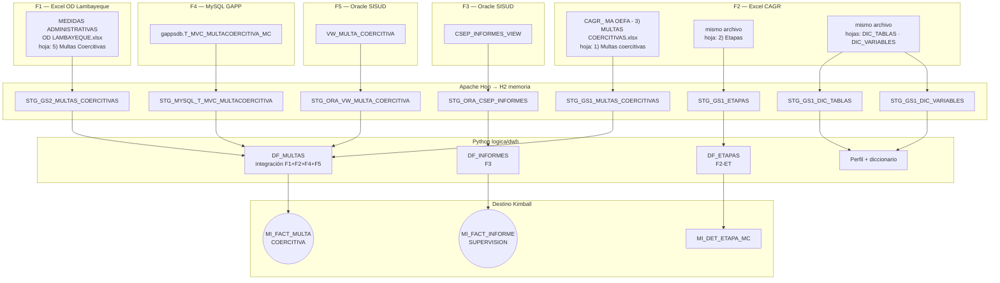
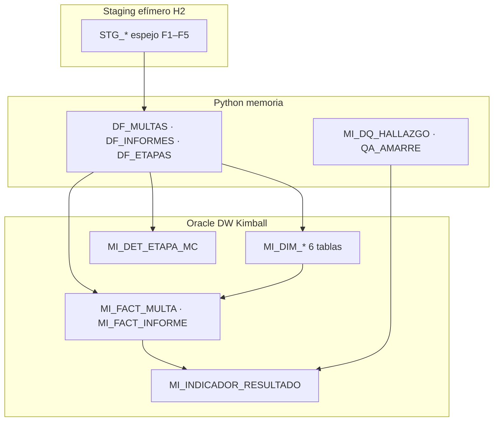
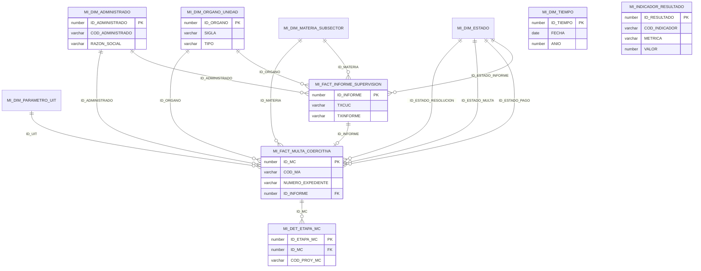
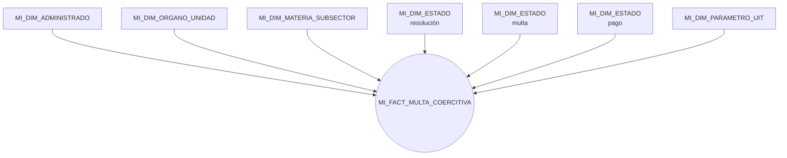
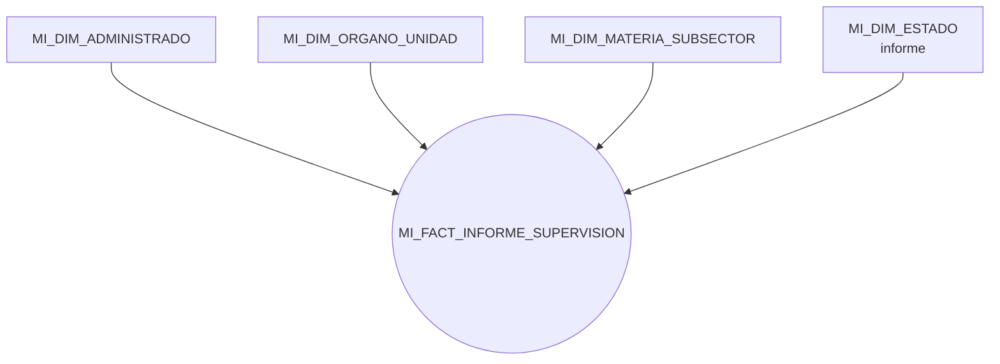
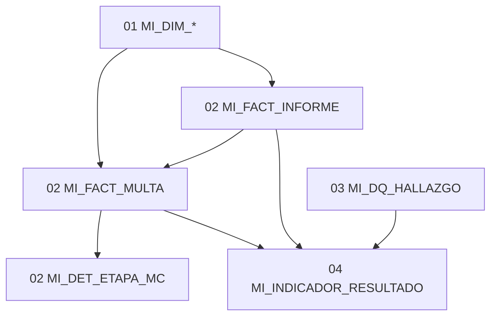

# Modelo Kimball — multas coercitivas e informes de supervisión (OEFA)

Vista general del **data warehouse** que carga el ETL (`logica/dwh/` → `cargar_dw.py`) en Oracle **BD_CURSOR**.  
Prefijo de tablas: `**MI_**`. Esquema según entorno: `APP` (local) o `REPOCSEP` (remote).

Referencias: `[../lineamientos/PROPUESTA_ADAPTADA_ETL.md](../lineamientos/PROPUESTA_ADAPTADA_ETL.md)`, DDL en `[../lineamientos/ddl/](../lineamientos/ddl/)`, mapeo en `[../lineamientos/ANEXO_MAPEO_CAMPOS.md](../lineamientos/ANEXO_MAPEO_CAMPOS.md)`. Manifiesto de extracción: `[../../inputs.yaml](../../inputs.yaml)`.

---

## 0. Fuentes de entrada (inputs)

Cinco fuentes operativas (**F1–F5**) declaradas en `inputs.yaml`. Hop extrae cada una a una tabla `**STG_*`** en H2 (espejo 1:1); Python integra hacia el modelo dimensional.




### Resumen por fuente


| ID         | Origen           | Tipo     | Objeto / archivo                                      | Tabla STG                         | Uso en el DW                                  |
| ---------- | ---------------- | -------- | ----------------------------------------------------- | --------------------------------- | --------------------------------------------- |
| **F1**     | Excel Lambayeque | `excel`  | `MEDIDAS ADMINISTRATIVAS OD LAMBAYEQUE.xlsx`          | `STG_GS2_MULTAS_COERCITIVAS`      | Hecho multa (universo OD Lambayeque)          |
| **F2**     | Excel CAGR       | `excel`  | `CAGR_ MA OEFA - 3) MULTAS COERCITIVAS.xlsx` → multas | `STG_GS1_MULTAS_COERCITIVAS`      | Hecho multa (universo CAGR)                   |
| **F2-ET**  | Excel CAGR       | `excel`  | misma libro → `2) Etapas`                             | `STG_GS1_ETAPAS`                  | Detalle etapas MC                             |
| **F2-DIC** | Excel CAGR       | `excel`  | `DIC_TABLAS` / `DIC_VARIABLES`                        | `STG_GS1_DIC_`*                   | Perfilamiento y diccionario de campos         |
| **F3**     | Oracle SISUD     | `oracle` | `SISUD.CSEP_INFORMES_VIEW`                            | `STG_ORA_CSEP_INFORMES`           | Hecho informe de supervisión                  |
| **F4**     | MySQL GAPP       | `mysql`  | `gappsdb.T_MVC_MULTACOERCITIVA_MC`                    | `STG_MYSQL_T_MVC_MULTACOERCITIVA` | Conciliación multa (CUM/CAM, estados, SIGED)  |
| **F5**     | Oracle SISUD     | `oracle` | `SISUD.VW_MULTA_COERCITIVA`                           | `STG_ORA_VW_MULTA_COERCITIVA`     | Hecho multa (expediente, resolución, CUM/CAM) |


**Integración multas:** F1 + F2 + F4 + F5 se unen en `DF_MULTAS` con `FUENTE_ORIGEN` por registro; F5 y F4 aportan campos de conciliación (p. ej. CUM/CAM, expediente). **Amarre H9:** F3 ↔ hecho multa por expediente / CUM+CAM → `ID_INFORME`.

---

## 1. Arquitectura en capas




| Capa            | Tablas                   | Rol                                                              |
| --------------- | ------------------------ | ---------------------------------------------------------------- |
| **Dimensiones** | 6 × `MI_DIM_`*           | Contexto analítico (quién, dónde, cuándo, estado, UIT)           |
| **Hechos**      | 2 × `MI_FACT_`*          | Eventos medibles: multa coercitiva e informe de supervisión      |
| **Detalle**     | `MI_DET_ETAPA_MC`        | Etapas del flujo interno de elaboración de la MC (1:N con multa) |
| **Calidad**     | `MI_DQ_HALLAZGO`         | Hallazgos R01–R05 (auditoría, sin FK dura a hechos)              |
| **Indicadores** | `MI_INDICADOR_RESULTADO` | KPIs K1–K5 precalculados por corrida                             |


---

## 2. Estrella dimensional (relaciones)

Dos hechos comparten dimensiones **conformadas** (mismo significado en ambos).  
`MI_DIM_TIEMPO` existe para agrupar por calendario; en hechos las fechas del ciclo van como columnas `DATE` directas.




### Amarre multas ↔ informes (H9)

**H9** es la hipótesis de diseño n.º 9 del lineamiento ([`PROPUESTA_ADAPTADA_ETL.md`](../lineamientos/PROPUESTA_ADAPTADA_ETL.md)): *las fuentes no comparten una llave única con correspondencia total*, así que el cruce entre sistemas es parcial y debe medirse, no forzarse con descartes.

| Qué implica | Detalle |
|---|---|
| Problema | Multas (F1/F2/F4/F5) e informes (F3) usan códigos distintos para el mismo caso. |
| Regla ETL | Cuarentena blanda: no se eliminan registros sin match; se deja `ID_INFORME` vacío o `-1`. |
| Métrica | **K5** → `PCT_AMARRE`; en corrida también `QA_AMARRE` (memoria Python). |
| Implementación | `logica/dwh/calidad.py` (`_amarre`), `logica/dwh/dimensional.py` (`_amarre_informe`). |

**Claves que intenta el cruce:**

- Multa ↔ informe: `NUMERO_EXPEDIENTE` ↔ `TXCUC` / `TXNUMEXP`
- Entre fuentes de multa: `COD_MA`, `CUM`, `CAM` (Excel ↔ SISUD ↔ GAPP)

Cuando hay coincidencia, `MI_FACT_MULTA_COERCITIVA.ID_INFORME` apunta a `MI_FACT_INFORME_SUPERVISION`.

---

## 3. Diccionario de datos (resumen)

Convención: clave `**-1**` = miembro *NO ESPECIFICADO* en dimensiones.

### 3.1 Dimensiones (`MI_DIM_*`)


| Tabla                        | Grano                        | Campos clave                                                     | Uso analítico                                       |
| ---------------------------- | ---------------------------- | ---------------------------------------------------------------- | --------------------------------------------------- |
| **MI_DIM_TIEMPO**            | 1 fila = 1 día               | `ID_TIEMPO` (AAAAMMDD), `ANIO`, `MES`, `TRIMESTRE`, `ES_FERIADO` | Agrupar por periodo; cálculo días hábiles en etapas |
| **MI_DIM_ADMINISTRADO**      | 1 fila = 1 administrado      | `COD_ADMINISTRADO`, `RAZON_SOCIAL`, `RUC`                        | Sujeto fiscalizado                                  |
| **MI_DIM_ORGANO_UNIDAD**     | 1 fila = 1 órgano/OD         | `SIGLA`, `NOMBRE`, `TIPO` (DIRECCION/COORD/ODES/OD)              | Órgano desconcentrado, coordinación                 |
| **MI_DIM_MATERIA_SUBSECTOR** | 1 fila = 1 materia           | `NOMBRE` (Hidrocarburos, Minería, …)                             | Subsector ambiental                                 |
| **MI_DIM_ESTADO**            | 1 fila = 1 estado tipificado | `TIPO_ESTADO`, `CODIGO`, `GRUPO`                                 | Resolución, multa, pago, informe, etapa, descargos  |
| **MI_DIM_PARAMETRO_UIT**     | 1 fila = 1 año UIT           | `ANIO`, `VALOR_UIT`                                              | Conversión UIT ↔ soles                              |


### 3.2 Hechos (`MI_FACT_*`)


| Tabla                           | Grano                       | Medidas / fechas principales                                                                                                                                                                         | Uso analítico                                                                                                                         | Fuente integrada |
| ------------------------------- | --------------------------- | ---------------------------------------------------------------------------------------------------------------------------------------------------------------------------------------------------- | ------------------------------------------------------------------------------------------------------------------------------------- | ---------------- |
| **MI_FACT_MULTA_COERCITIVA**    | 1 fila = 1 multa coercitiva | Montos: `MONTO_UIT`, `MONTO_S`, `MONTO_MULTA_REC/TFA`. Fechas ciclo: notificación DCG → firma → vencimiento → pago → verificación. Flags: pagada, EF, verificación. Días: `DIAS_NOTIF_A_FIRMA`, etc. | Cobranza (K3), oportunidad del ciclo (K2), verificación posterior a la multa (K4); montos y plazos por órgano, administrado o materia | F1+F2+F4+F5      |
| **MI_FACT_INFORME_SUPERVISION** | 1 fila = 1 informe          | Fechas: `F_INICIO`, `F_FIN`, `F_INFORME`, `F_INFORME_ESPERADO`. Días: `DIAS_SUPERVISION`, `DIAS_ELAB_INFORME`. Flags: oportuno, derivado                                                             | Cobertura de supervisión (K1), oportunidad y duración de informes; cruce con multas vía amarre H9                                     | F3               |


Degeneradas útiles (sin dimensión aparte): `COD_MA`, `CUM`, `CAM`, `TXCUC`, `TXINFORME`, `NUMERO_EXPEDIENTE`.

### 3.3 Detalle y soporte

| Tabla | Grano | Relación | Campos clave | Uso analítico |
|---|---|---|---|---|
| **MI_DET_ETAPA_MC** | 1 fila = 1 etapa del proyecto de multa coercitiva | N:1 → `MI_FACT_MULTA_COERCITIVA` | `COD_PROY_MC`, `NRO_ETAPA`, `ACCION`, `ENCARGADO`, `DIAS_ELABORACION` | Drill-down del flujo interno de elaboración; días y responsables por etapa (cuello de botella) |
| **MI_DQ_HALLAZGO** | 1 fila = 1 defecto detectado | Sin FK a hechos (auditoría) | `REGLA_CODIGO` R01–R05, `FUENTE_ORIGEN`, `SEVERIDAD`, `REGISTRO_ID` | Trazabilidad de calidad; alimenta K5 (`PCT_CONFORME`); defensa de cifras ante terceros |
| **MI_INDICADOR_RESULTADO** | 1 fila = 1 métrica en un grano | Derivada de hechos + DQ | `COD_INDICADOR` K1–K5, `METRICA`, `NUMERADOR`, `DENOMINADOR`, `VALOR` | KPIs precalculados listos para Power BI / Superset (cobertura, cobranza, oportunidad, amarre H9) |

---

## 4. Flujo de relaciones (lectura analítica)

Dos **esquemas estrella** independientes (uno por hecho). Comparten dimensiones conformadas (`MI_DIM_ADMINISTRADO`, `MI_DIM_ORGANO_UNIDAD`, etc.): mismo `ID_`*, mismo significado en ambos hechos. Las fechas del ciclo están en la tabla de hechos; `MI_DIM_TIEMPO` permite agrupar por calendario.

### 4.1 Estrella — multa coercitiva




`MI_DIM_ESTADO` es **role-playing**: la misma dimensión se une tres veces al hecho (resolución, multa, pago) con FK distintas.  
`ID_INFORME` en el hecho multa apunta al informe relacionado cuando el amarre H9 (expediente / CUM+CAM) coincide.

### 4.2 Estrella — informe de supervisión




### 4.3 Tablas de soporte (fuera de la estrella)


| Tabla                      | Relación con los hechos                                       |
| -------------------------- | ------------------------------------------------------------- |
| **MI_DET_ETAPA_MC**        | Detalle 1:N colgando del hecho multa (`ID_MC`).               |
| **MI_INDICADOR_RESULTADO** | Agregados K1–K5 calculados a partir de ambos hechos.          |
| **MI_DQ_HALLAZGO**         | Auditoría de calidad (R01–R05); alimenta K5, sin FK al hecho. |
| **MI_DIM_TIEMPO**          | Agrupación por periodo sobre las fechas `DATE` del hecho.     |


### 4.4 Patrones de lectura


| Patrón Kimball   | Cómo se aplica                                                                                        |
| ---------------- | ----------------------------------------------------------------------------------------------------- |
| **Drill-across** | Cruzar multas e informes por `ID_ADMINISTRADO`, `ID_ORGANO` o `ID_MATERIA` (dimensiones compartidas). |
| **Drill-down**   | De `MI_FACT_MULTA_COERCITIVA` → `MI_DET_ETAPA_MC` por `ID_MC` / `COD_PROY_MC`.                        |
| **Role-playing** | `MI_DIM_ESTADO` con distinto `TIPO_ESTADO` según el rol (informe vs resolución vs pago).              |
| **Degeneradas**  | `COD_MA`, `TXCUC`, `NUMERO_EXPEDIENTE` en el hecho, sin dimensión propia.                             |
| **Amarre H9**    | `MI_FACT_MULTA.ID_INFORME` → `MI_FACT_INFORME` cuando el cruce por expediente/CUM+CAM coincide.       |


---

## 5. KPIs precalculados (tabla `MI_INDICADOR_RESULTADO`)

El ETL materializa **K1–K5** en cada corrida (~585 filas típicas). Grano habitual: `(ANIO, ID_ORGANO)` más filas `TOTAL`.


| Código | Nombre                | Métricas                                     | Interpretación                                    |
| ------ | --------------------- | -------------------------------------------- | ------------------------------------------------- |
| **K1** | Cobertura             | `N_MULTAS`, `N_INFORMES`                     | Volumen por año y órgano                          |
| **K2** | Oportunidad del ciclo | `PROM_DIAS_NOTIF_FIRMA`                      | Promedio días notificación DCG → firma resolución |
| **K3** | Efectividad cobranza  | `RATIO_COBRANZA_SOLES`, `RATIO_COBRANZA_UIT` | Cobrado / impuesto (multas con resolución)        |
| **K4** | Verificación post-MC  | `TASA_VERIF_POST_MC`                         | % multas con verificación posterior registrada    |
| **K5** | Calidad del dato      | `PCT_CONFORME`, `PCT_AMARRE`                 | % registros conformes (R01–R05) y % amarre H9     |


Columnas del indicador: `COD_INDICADOR`, `NOMBRE_INDICADOR`, `ANIO`, `ID_ORGANO`, `ID_MATERIA`, `METRICA`, `SUBGRANO`, `NUMERADOR`, `DENOMINADOR`, `VALOR`, `UNIDAD`, `ID_CARGA`.

Consulta típica:

```sql
SELECT COD_INDICADOR, METRICA, ANIO, ID_ORGANO, VALOR, UNIDAD
  FROM MI_INDICADOR_RESULTADO
 ORDER BY COD_INDICADOR, ANIO, ID_ORGANO;
```

---

## 6. KPIs adicionales posibles (sobre hechos, no precalculados)

Estos se arman en **Power BI / Superset / SQL** cruzando hechos y dimensiones:


| Área     | KPI ejemplo                  | Origen                                                                  |
| -------- | ---------------------------- | ----------------------------------------------------------------------- |
| Multas   | Multas activas por órgano    | `COUNT(*)` en `MI_FACT_MULTA_COERCITIVA` + `MI_DIM_ESTADO` (tipo MULTA) |
| Multas   | Monto total UIT / soles      | `SUM(MONTO_UIT)`, `SUM(MONTO_S_CALC)`                                   |
| Multas   | % pagadas                    | `SUM(FLAG_PAGADA) / COUNT(*)`                                           |
| Multas   | Tiempo medio hasta pago      | `AVG(DIAS_VENC_A_PAGO)`                                                 |
| Informes | Informes oportunos           | `SUM(FLAG_INFORME_OPORTUNO) / COUNT(*)`                                 |
| Informes | Duración supervisión         | `AVG(DIAS_SUPERVISION)`                                                 |
| Cruzado  | Multas con informe amarrado  | `COUNT` donde `ID_INFORME IS NOT NULL`                                  |
| Calidad  | Hallazgos críticos por regla | `MI_DQ_HALLAZGO` agrupado por `REGLA_CODIGO`                            |
| Etapas   | Días promedio por etapa      | `MI_DET_ETAPA_MC` por `ACCION`                                          |


---

## 7. Orden de carga y dependencias




DDL: `[01_dimensiones.sql](../lineamientos/ddl/01_dimensiones.sql)` → `[02_hechos.sql](../lineamientos/ddl/02_hechos.sql)` → `[03_bitacora.sql](../lineamientos/ddl/03_bitacora.sql)` → `[04_indicadores.sql](../lineamientos/ddl/04_indicadores.sql)`.

---

## 8. Volúmenes de referencia (corrida típica)


| Objeto                        | Orden de magnitud                        |
| ----------------------------- | ---------------------------------------- |
| `MI_FACT_MULTA_COERCITIVA`    | ~570                                     |
| `MI_FACT_INFORME_SUPERVISION` | ~53 000                                  |
| `MI_DET_ETAPA_MC`             | ~55                                      |
| `MI_DQ_HALLAZGO`              | ~11                                      |
| `MI_INDICADOR_RESULTADO`      | ~585                                     |
| `MI_DIM_*`                    | miles (administrados, tiempo calendario) |


Cifras exactas dependen de la corrida ETL y del entorno (local vs remote).