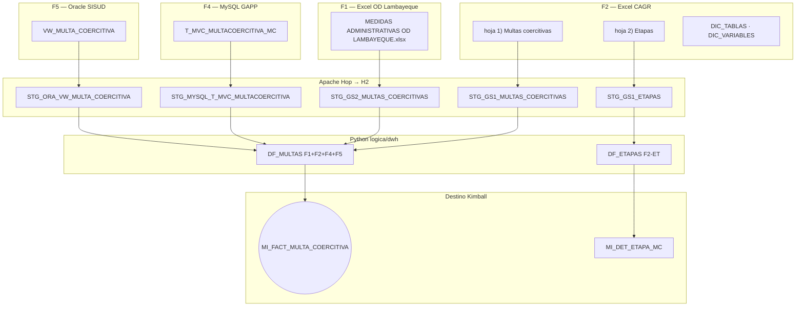
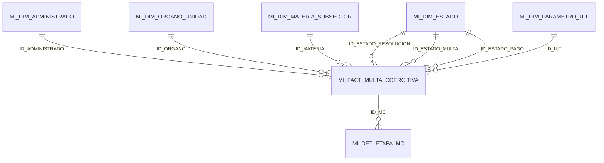
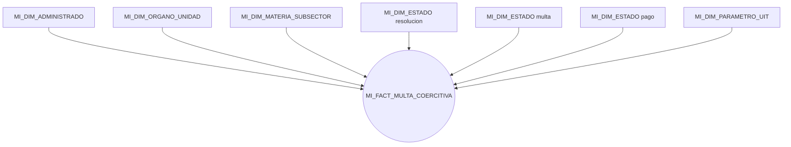

# Modelo Kimball — multas coercitivas (OEFA)

Vista general del **data warehouse** que carga el ETL (`logica/dwh/` → `cargar_dw.py`) en Oracle **BD_CURSOR**.  
Prefijo de tablas: **`MI_`**. Esquema según entorno: `APP` (local) o `REPOCSEP` (remote).

**Alcance:** solo Multas. F3 (informes de supervisión) no entra en Hop, Kimball ni Oracle.

Referencias: [`../lineamientos/PROPUESTA_ADAPTADA_ETL.md`](../lineamientos/PROPUESTA_ADAPTADA_ETL.md), DDL en [`../lineamientos/ddl/`](../lineamientos/ddl/), mapeo en [`../lineamientos/ANEXO_MAPEO_CAMPOS.md`](../lineamientos/ANEXO_MAPEO_CAMPOS.md). Manifiesto: [`../../inputs.yaml`](../../inputs.yaml).

---

## 0. Fuentes de entrada (inputs)

Cuatro fuentes de multa (**F1, F2, F4, F5**) declaradas en `inputs.yaml`. Hop extrae cada una a `STG_*` en H2; Python integra hacia el modelo dimensional.

| ID | Origen | Tabla STG | Uso en el DW |
|---|---|---|---|
| **F1** | Excel Lambayeque | `STG_GS2_MULTAS_COERCITIVAS` | Hecho multa |
| **F2** | Excel CAGR | `STG_GS1_MULTAS_COERCITIVAS` | Hecho multa |
| **F2-ET** | Excel CAGR etapas | `STG_GS1_ETAPAS` | Detalle etapas |
| **F2-DIC** | Diccionario | `STG_GS1_DIC_*` | Perfilamiento |
| **F4** | MySQL GAPP | `STG_MYSQL_T_MVC_MULTACOERCITIVA` | Conciliación CUM/CAM |
| **F5** | Oracle SISUD | `STG_ORA_VW_MULTA_COERCITIVA` | Expediente, resolución, CUM/CAM |

**Integración:** F1+F2+F4+F5 en `DF_MULTAS` con `FUENTE_ORIGEN`. **H9:** amarre entre fuentes de multa (COD_MA, CUM F4↔F5), medido en `QA_AMARRE` / K5. No hay hecho informe ni `ID_INFORME`.

---

## 1. Arquitectura en capas

| Capa | Tablas | Rol |
|---|---|---|
| **Dimensiones** | 6 × `MI_DIM_*` | Quién, dónde, cuándo, estado, UIT |
| **Hechos** | 1 × `MI_FACT_MULTA_COERCITIVA` | Evento medible: multa coercitiva |
| **Detalle** | `MI_DET_ETAPA_MC` | Etapas del flujo interno (1:N con multa) |
| **Calidad** | `MI_DQ_HALLAZGO` | Hallazgos R01–R05 |
| **Indicadores** | `MI_INDICADOR_RESULTADO` | KPIs K1–K5 |

---

## 2. Estrella dimensional

Un hecho. `MI_DIM_TIEMPO` agrupa por calendario; las fechas del ciclo van como columnas `DATE` en el hecho.

### Amarre H9 (fuentes de multa)

Las fuentes no comparten llave única con correspondencia total. El cruce se **mide** (K5 / `QA_AMARRE`), no se fuerza con INNER JOIN.

Claves: `COD_MA`, `CUM`, `CAM`, `NUMERO_EXPEDIENTE` entre Excel, SISUD vista y GAPP.

---

## 3. Diccionario de datos (resumen)

Clave **-1** = miembro *NO ESPECIFICADO*.

| Tabla | Grano | Uso |
|---|---|---|
| **MI_DIM_TIEMPO** | 1 día | Periodo; días hábiles |
| **MI_DIM_ADMINISTRADO** | 1 administrado | Sujeto fiscalizado (desde nombre F5/Excel) |
| **MI_DIM_ORGANO_UNIDAD** | 1 órgano | COORD / expediente |
| **MI_DIM_MATERIA_SUBSECTOR** | 1 materia | Catálogo semilla (`-1` si no hay dato en multa) |
| **MI_DIM_ESTADO** | 1 estado | Resolución, multa, pago, etapa, descargos |
| **MI_DIM_PARAMETRO_UIT** | 1 año | Conversión UIT ↔ soles |
| **MI_FACT_MULTA_COERCITIVA** | 1 multa | Cobranza (K3), oportunidad (K2), verificación (K4) |
| **MI_DET_ETAPA_MC** | 1 etapa | Drill-down del flujo interno |
| **MI_DQ_HALLAZGO** | 1 defecto | Auditoría R01–R05; alimenta K5 |
| **MI_INDICADOR_RESULTADO** | 1 métrica | KPIs K1–K5 |

Degeneradas: `COD_MA`, `CUM`, `CAM`, `NUMERO_EXPEDIENTE`.

---

## 4. Estrella — multa coercitiva

`MI_DIM_ESTADO` es **role-playing** (resolución / multa / pago). Drill-down a `MI_DET_ETAPA_MC` por `ID_MC`.

---

## 5. KPIs (`MI_INDICADOR_RESULTADO`)

| Código | Nombre | Métricas |
|---|---|---|
| **K1** | Cobertura | `N_MULTAS` por año y órgano |
| **K2** | Oportunidad del ciclo | `PROM_DIAS_NOTIF_FIRMA` |
| **K3** | Efectividad cobranza | `RATIO_COBRANZA_SOLES`, `RATIO_COBRANZA_UIT` |
| **K4** | Verificación post-MC | `TASA_VERIF_POST_MC` |
| **K5** | Calidad del dato | `PCT_CONFORME`, `PCT_AMARRE` (puentes de multa) |

---

## 6. Orden de carga

`MI_DIM_*` → `MI_FACT_MULTA_COERCITIVA` → `MI_DET_ETAPA_MC` → `MI_DQ_HALLAZGO` → `MI_INDICADOR_RESULTADO`.

DDL: [`01_dimensiones.sql`](../lineamientos/ddl/01_dimensiones.sql) → [`02_hechos.sql`](../lineamientos/ddl/02_hechos.sql) → [`03_bitacora.sql`](../lineamientos/ddl/03_bitacora.sql) → [`04_indicadores.sql`](../lineamientos/ddl/04_indicadores.sql).

---

## 7. Volúmenes de referencia (corrida típica)

| Objeto | Orden de magnitud |
|---|---|
| `MI_FACT_MULTA_COERCITIVA` | ~570 |
| `MI_DET_ETAPA_MC` | ~55 |
| `MI_DQ_HALLAZGO` | decenas |
| `MI_INDICADOR_RESULTADO` | cientos (K1–K5, grano año×órgano) |

Cifras exactas dependen de la corrida y del entorno.
