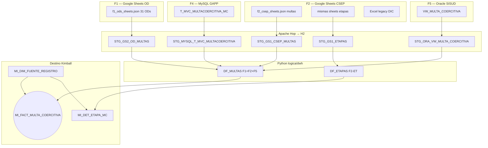
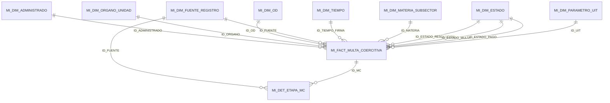
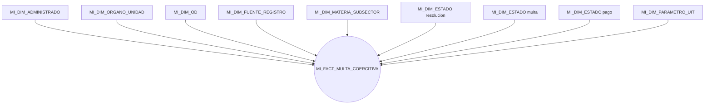

# Modelo Kimball — multas coercitivas (OEFA)

Vista general del **data warehouse** que carga el ETL (`logica/dwh/` → `cargar_dw.py`) en Oracle **BD_CURSOR**.  
Prefijo de tablas: **`MI_`**. Esquema según entorno: `APP` (local) o `REPOCSEP` (remote).

**Alcance:** solo Multas. F3 (informes de supervisión) no entra en Hop, Kimball ni Oracle.

**Primera vez con Kimball / este DW:** empieza por [`guia-leer-modelo-dimensional.md`](guia-leer-modelo-dimensional.md).

Referencias: [`../lineamientos/PROPUESTA_ADAPTADA_ETL.md`](../lineamientos/PROPUESTA_ADAPTADA_ETL.md), DDL en [`../lineamientos/ddl/`](../lineamientos/ddl/), mapeo en [`../lineamientos/ANEXO_MAPEO_CAMPOS.md`](../lineamientos/ANEXO_MAPEO_CAMPOS.md). Manifiesto: [`../../inputs.yaml`](../../inputs.yaml). Inputs: [`../inputs/README.md`](../inputs/README.md).

---

## 0. Fuentes de entrada (inputs)

Tres fuentes de multa activas (**F1, F2, F5**); F4 GAPP fuera de ingestión declaradas en `inputs.yaml`. Hop extrae cada una a `STG_*` en H2; Python integra hacia el modelo dimensional. Cada fila del hecho queda etiquetada con `ID_FUENTE` → `MI_DIM_FUENTE_REGISTRO`. Reportes por universo: vistas `VW_MC_CSEP` / `VW_MC_OD` / `VW_MC_SISUD`.

| ID | Origen | Tabla STG | Uso en el DW | `CODIGO` fuente |
|---|---|---|---|---|
| **F1** | Google Sheets familia OD (31; `MI_DIM_OD`) | `STG_GS2_OD_MULTAS` | Hecho + `ID_OD` | `OD_SHEETS` |
| **F2** | Sheets CSEP (10 unidades) | `STG_GS1_CSEP_MULTAS` | Hecho + `ID_ORGANO` | `CAGR` |
| **F2-ET** | Sheets CSEP etapas | `STG_GS1_ETAPAS` | Detalle etapas | `CAGR` |
| **F2-DIC** | Diccionario (Excel legacy) | `STG_GS1_DIC_*` | Perfilamiento | — |
| **F4** | MySQL GAPP | — | **Fuera de ingestión** (semilla `ID_FUENTE=3`) | `GAPPS` |
| **F5** | Oracle SISUD | `STG_ORA_VW_MULTA_COERCITIVA` | Expediente, resolución, CUM/CAM | `SISUD_VW` |

**Integración:** F1+F2+F5 en `DF_MULTAS` → hecho con `ID_FUENTE` (+ `ID_TIEMPO_FIRMA` role-playing). Territorio F1: `ID_OD` → `MI_DIM_OD`. Territorio F2: `ID_ORGANO` → `MI_DIM_ORGANO_UNIDAD` (`DESCRIPCION` desde catálogo). **H9:** amarre medido en `MI_QA_AMARRE` / `MI_QA_AMARRE_DETALLE` / K5. No hay hecho informe ni `ID_INFORME`.

---

## 1. Arquitectura en capas

| Capa | Tablas | Rol |
|---|---|---|
| **Dimensiones** | 8 × `MI_DIM_*` | Quién, dónde (órgano + OD), **fuente**, cuándo, estado, UIT |
| **Hechos** | 1 × `MI_FACT_MULTA_COERCITIVA` | Evento medible: multa coercitiva |
| **Detalle** | `MI_DET_ETAPA_MC` | Etapas del flujo interno (1:N con multa) |
| **Calidad** | `MI_DQ_HALLAZGO`, `MI_QA_AMARRE`, `MI_QA_AMARRE_DETALLE` | Hallazgos R01–R05; amarre H9 resumen + claves sin match |
| **Vistas** | `VW_MC_*` | Universos CSEP / OD / SISUD (no sumar 1801 “como uno”) |
| **Indicadores** | `MI_INDICADOR_RESULTADO` | KPIs K1–K5 |

---

## 2. Estrella dimensional

Un hecho. Fechas del ciclo como columnas `DATE`; además `ID_TIEMPO_FIRMA` (role-playing) hacia `MI_DIM_TIEMPO` para cortes Q/año en BI.

### Amarre H9 (fuentes de multa)

Las fuentes no comparten llave única con correspondencia total. El cruce se **mide** (`MI_QA_AMARRE` + detalle `MI_QA_AMARRE_DETALLE` + K5), no se fuerza con INNER JOIN.

Claves: `COD_MA`, `CUM`, `CAM`, `NUMERO_EXPEDIENTE` entre Sheets OD/CSEP, SISUD vista y GAPP.

---

## 3. Diccionario de datos (resumen)

Clave **-1** = miembro *NO ESPECIFICADO*.

| Tabla | Grano | Uso |
|---|---|---|
| **MI_DIM_TIEMPO** | 1 día | Periodo; días hábiles |
| **MI_DIM_ADMINISTRADO** | 1 administrado | Sujeto fiscalizado (desde nombre F5 / Sheets) |
| **MI_DIM_ORGANO_UNIDAD** | 1 órgano CSEP | Solo catálogo F2 (10 + ND); no siglas de expediente |
| **MI_DIM_OD** | 1 oficina F1 | Territorio Sheets OD |
| **MI_DIM_FUENTE_REGISTRO** | 1 universo de origen | `CODIGO` (F1…F5 + legacy `OD_EXCEL`) |
| **MI_DIM_MATERIA_SUBSECTOR** | 1 materia | Catálogo semilla (`-1` si no hay dato en multa) |
| **MI_DIM_ESTADO** | 1 estado | Resolución, multa, pago, etapa, descargos |
| **MI_DIM_PARAMETRO_UIT** | 1 año | Conversión UIT ↔ soles |
| **MI_FACT_MULTA_COERCITIVA** | 1 multa | Cobranza (K3), oportunidad (K2), verificación (K4) |
| **MI_DET_ETAPA_MC** | 1 etapa | Drill-down del flujo interno (F2) |
| **MI_DQ_HALLAZGO** | 1 defecto | Auditoría R01–R05; alimenta K5 |
| **MI_QA_AMARRE** | 1 puente | % match H9 agregado |
| **MI_QA_AMARRE_DETALLE** | 1 clave sin match | Pares SOLO_IZQ / SOLO_DER + motivo |
| **MI_INDICADOR_RESULTADO** | 1 métrica | KPIs K1–K5 |

Degeneradas en el hecho: `COD_MA`, `CUM`, `CAM`, `NUMERO_EXPEDIENTE` (linaje de universo solo vía `ID_FUENTE`).

### Semillas `MI_DIM_FUENTE_REGISTRO`

| ID | CODIGO | NOMBRE | FAMILIA |
|---|---|---|---|
| −1 | `ND` | NO ESPECIFICADO | ND |
| 1 | `OD_SHEETS` | Sheets OD | F1 |
| 2 | `CAGR` | Sheets CSEP | F2 |
| 3 | `GAPPS` | MySQL GAPP (histórico) | F4 |
| 4 | `SISUD_VW` | Oracle SISUD | F5 |
| 5 | `OD_EXCEL` | Excel OD (legacy) | F1 |

---

## 4. Estrella — multa coercitiva

`MI_DIM_ESTADO` es **role-playing** (resolución / multa / pago). Drill-down a `MI_DET_ETAPA_MC` por `ID_MC` (etapas también llevan `ID_FUENTE` = CAGR).

---

## 5. KPIs (`MI_INDICADOR_RESULTADO`)

| Código | Nombre | Métricas |
|---|---|---|
| **K1** | Cobertura | `N_MULTAS` por año y órgano |
| **K2** | Oportunidad del ciclo | `PROM_DIAS_NOTIF_FIRMA` |
| **K3** | Efectividad cobranza | `RATIO_COBRANZA_SOLES`, `RATIO_COBRANZA_UIT` |
| **K4** | Verificación post-MC | `TASA_VERIF_POST_MC` |
| **K5** | Calidad del dato | `PCT_CONFORME`, `PCT_AMARRE` (puentes de multa) |

---

## 6. Orden de carga

`MI_DIM_*` → `MI_FACT_MULTA_COERCITIVA` → `MI_DET_ETAPA_MC` → `MI_DQ_HALLAZGO` → `MI_QA_AMARRE*` → `MI_INDICADOR_RESULTADO` → vistas `06_vistas.sql`.

DDL: [`01_dimensiones.sql`](../lineamientos/ddl/01_dimensiones.sql) → [`02_hechos.sql`](../lineamientos/ddl/02_hechos.sql) → [`03_bitacora.sql`](../lineamientos/ddl/03_bitacora.sql) → [`04_indicadores.sql`](../lineamientos/ddl/04_indicadores.sql) → [`06_vistas.sql`](../lineamientos/ddl/06_vistas.sql).

---

## 7. Volúmenes de referencia (corrida local reciente)

Tras `./init.sh` en esquema `APP` (orientativo; cambia por corrida):

| Objeto | Filas |
|---|---|
| `MI_DIM_TIEMPO` | ~4 384 |
| `MI_DIM_ADMINISTRADO` | ~194 |
| `MI_DIM_ORGANO_UNIDAD` | ~11 (10 CSEP + ND) |
| `MI_DIM_OD` | 33 |
| `MI_DIM_FUENTE_REGISTRO` | 6 |
| `MI_DIM_MATERIA_SUBSECTOR` | 7 |
| `MI_DIM_ESTADO` | ~21 |
| `MI_DIM_PARAMETRO_UIT` | 12 |
| `MI_FACT_MULTA_COERCITIVA` | **~1 801** |
| · `CAGR` | ~986 |
| · `SISUD_VW` | ~530 |
| · `OD_SHEETS` | ~281 |
| `MI_DET_ETAPA_MC` | ~2 070 |
| `MI_DQ_HALLAZGO` | ~207 |
| `MI_QA_AMARRE_DETALLE` | ~3 078 |
| `MI_INDICADOR_RESULTADO` | ~691 |

F2 por unidad (ej.): CMIN ~387, CHID ~365, CRES ~173, CIND ~31, CAGR ~16, CELE ~14 (otras unidades pueden ir en 0).
