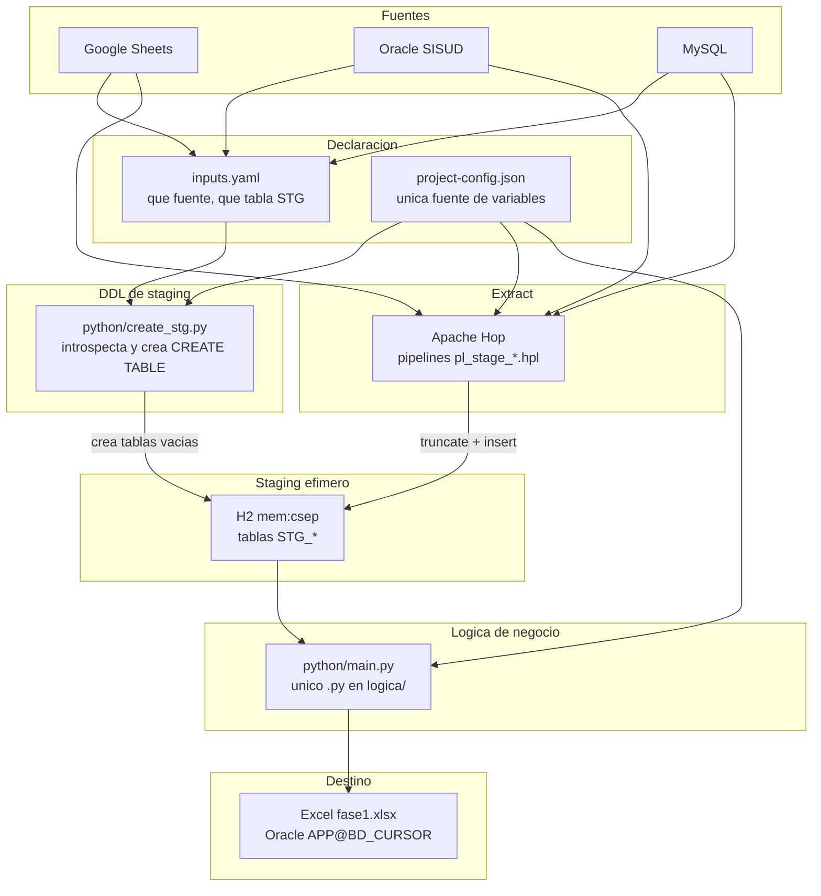
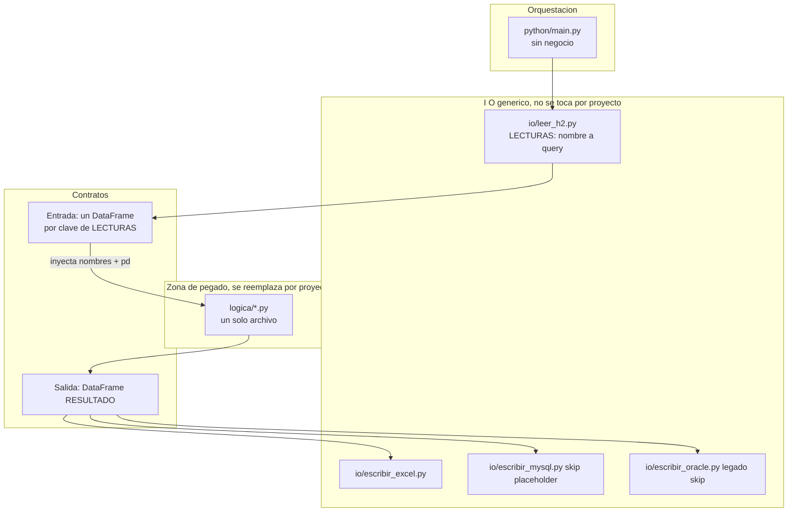
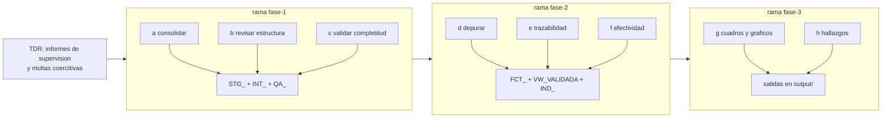

# Arquitectura del proyecto

Cómo está armado este ETL hoy, con foco en qué hace exactamente la capa de lógica
(Python). Rama `capa-python`: la capa R de `master` se reemplazó; el contrato es el mismo.

Estado: capa lógica alineada a [`lineamientos/PROPUESTA_ADAPTADA_ETL.md`](lineamientos/PROPUESTA_ADAPTADA_ETL.md)
**Fases 2–3** (`logica/dwh/`: perfilamiento, diccionario, homologación, integración en memoria).
Modelo dimensional `FACT_*`/`DIM_*` en Oracle BD_CURSOR = lineamiento Fases 5–6 (pendiente).
Detalle implementación: [`lineamientos/implementacion-fase-2-3.md`](lineamientos/implementacion-fase-2-3.md).
TDR: [`TDR REQ 3629-2026.pdf`](TDR%20REQ%203629-2026.pdf).

## Vista general

Cuatro tecnologías, cada una con un trabajo que las otras no hacen. Python aparece dos
veces a propósito: DDL de staging y lógica de negocio son entry points distintos.



| Capa | Hace | No hace |
|---|---|---|
| `inputs.yaml` | Declara fuentes y el nombre `STG_*` | Extraer filas |
| Python DDL | Introspecta el schema vivo y emite el DDL de H2 | Cargar datos ni reglas |
| Hop | Extrae 1:1 y carga `STG_*` | Lógica de negocio multi-fuente |
| Python lógica | Unión, reglas, esquema ancho | Abrir conexiones dentro de `logica/` |
| H2 | Landing tolerante, todo nullable | Persistir entre corridas |

La separación que sostiene el diseño: **`create_stg.py` decide la forma de las tablas, Hop
mueve las filas y `logica/` decide el significado**. H2 es solo el punto de
encuentro, in-memory a propósito: cada corrida arranca de cero.

## Qué hace la capa de lógica

Ahí vive el negocio. El resto del proyecto existe para dejarle los DataFrames en memoria
y para llevarse el resultado.

Está partida en tres responsabilidades que no se mezclan:



### La orquestación es deliberadamente tonta

`python/main.py` no tiene reglas de negocio. Hace cuatro cosas:

1. **Setup**: root + variables de `project-config.json`.
2. **Entrada**: carga `python/io/leer_h2.py` por ruta, llama a `leer_h2(root, variables)`.
3. **Lógica**: lista los `.py` de `logica/` (raíz del proyecto) y hace `exec` del único que encuentra,
   con los DataFrames y `pd` inyectados en el namespace.
4. **Salida**: verifica que exista `RESULTADO` y lo pasa a los escritores.

El paso 3 es el corazón del arquetipo: `main.py` **auto-descubre** el archivo de lógica y
**falla a propósito** si hay cero o más de uno. Esa restricción es la que hace que las
fases del servicio se manejen **por rama de git y no por carpetas**.

`python/io/` no se importa como paquete `io`: choca con la stdlib. `main.py` carga esos
módulos por ruta (`importlib`).

### El contrato: nombres, no argumentos

La lógica no recibe parámetros. Recibe **nombres ya poblados en el namespace**, que
salen de las claves de `LECTURAS`:

```python
LECTURAS = {
    "DEMO": "SELECT ID, TXNOMBRE, FEALTA FROM PUBLIC.DEMO_TABLA_EJEMPLO",
}
```

```python
RESULTADO = DEMO[["ID", "TXNOMBRE", "FEALTA"]].copy()
RESULTADO["FEALTA"] = pd.to_datetime(RESULTADO["FEALTA"]).dt.date
```

Agregar una fuente al ETL es agregar una clave a `LECTURAS` y usar ese nombre en la
lógica. Contrato: [`../python/CONTRATO.md`](../python/CONTRATO.md).

### Aislamiento: qué está prohibido dentro de logica/

Sin conexiones, sin jars, sin drivers, sin rutas de archivo. Todo eso vive en
`python/io/`. La lógica es **pegable**: se copia un `.py` escrito contra DataFrames y
corre. `pandas` llega inyectado como `pd`.

### La corrida completa

```mermaid
sequenceDiagram
  participant HOP as Hop wf_main
  participant H2 as H2 mem:csep
  participant MAIN as python/main.py
  participant LEER as io/leer_h2.py
  participant LOG as logica/*.py
  participant XLS as io/escribir_excel.py
  participant ESC as io/escribir_mysql Oracle

  HOP->>H2: reset (stop, start, DDL)
  HOP->>H2: pipelines: truncate + insert STG_*
  HOP->>MAIN: python/main.py
  MAIN->>LEER: leer_h2(root, variables)
  LEER->>H2: JDBC, una query por clave de LECTURAS
  H2-->>LEER: filas
  LEER-->>MAIN: dict de DataFrames
  MAIN->>LOG: exec del unico .py
  LOG-->>MAIN: RESULTADO
  MAIN->>XLS: output/resultado.xlsx
  MAIN->>ESC: skip si placeholders; si no TRUNCATE INSERT COUNT
```

Los escritores a BD consultan `COUNT(*)` **después** del `INSERT`. Contar el DataFrame en
memoria no prueba nada sobre la base.

## Qué se evitó al salir de R (y qué quedó)

| Evitado | Qué había |
|---|---|
| Segundo runtime | R 4.3.3 + RJDBC + rJava aparte del venv |
| JVM por partida doble | rJava más JPype |
| Orden frágil | `options(java.parameters=...)` antes de `library(RJDBC)` |
| Credenciales duplicadas | `leer_h2.R` hardcodeaba URL y `sa`/`csep` |
| Jar extra | `lib/ojdbc11.jar`; ahora `oracledb` thin |
| Ruido en el log de Hop | `message()` de R salía como `ERROR: (stderr)` |

Lo que **no** desapareció: la JVM. H2 solo expone JDBC y `jaydebeapi` arrastra JPype.

## Dónde va cada cosa cuando arranque el ETL



Las capas `INT_`, `FCT_`, `VW_*_VALIDADA`, `IND_` y `QA_` no existen todavía: se
construyen dentro de la capa de lógica, fase por fase. Reglas, controles de calidad y
por qué una rama por fase: [`../.agents/skills/auditable-soft-quarantine/SKILL.md`](../.agents/skills/auditable-soft-quarantine/SKILL.md). Fases técnicas del lineamiento: [`../.agents/skills/phased-dwh-lineamiento/SKILL.md`](../.agents/skills/phased-dwh-lineamiento/SKILL.md).
