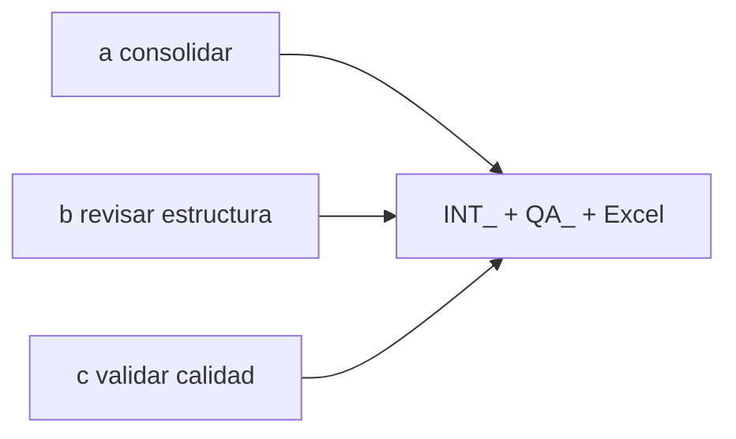
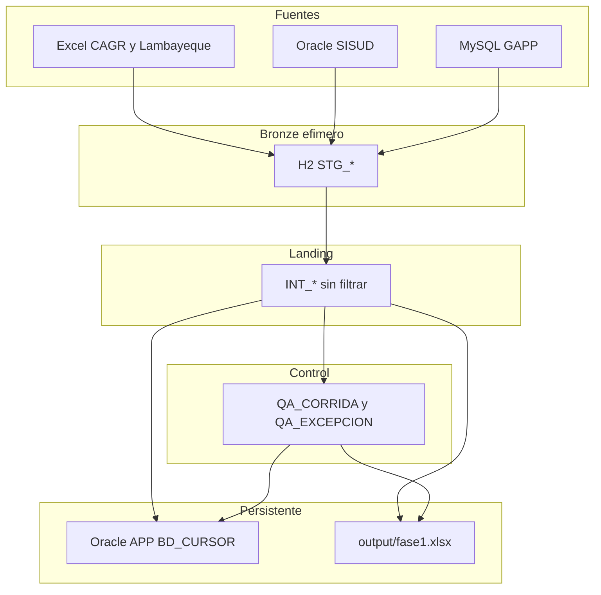
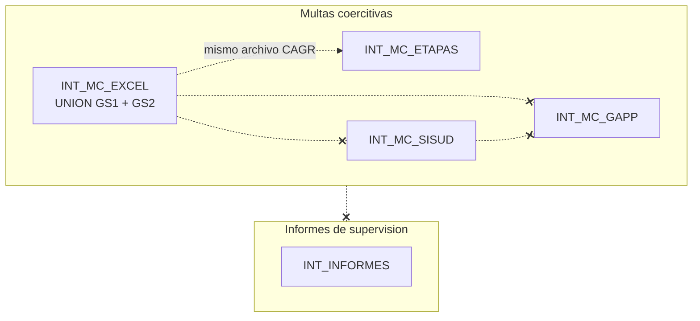
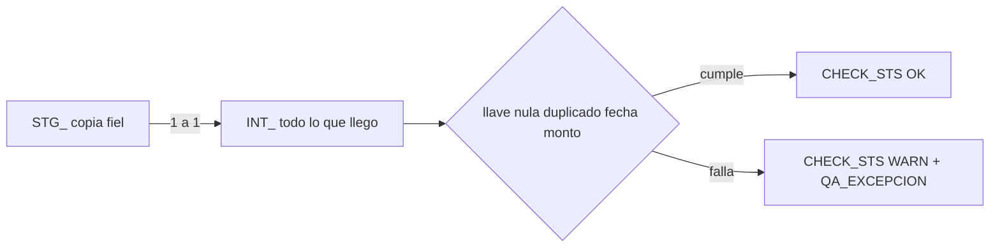

# Fase 1 — vista general

Qué se hizo en el entregable 1 (TDR **a, b, c**). El detalle está en [`fase-1.md`](fase-1.md). Dónde vive el dato (inputs → H2 → Oracle): [`antes-durante-fase1.md`](antes-durante-fase1.md). Nombres: [`glosario.md`](glosario.md).

La fase 1 **consolida y diagnostica**. No depura.

## Flujo

Fuentes 1:1 a H2. Python une sin filtrar y marca defectos. El resultado vive en BD_CURSOR y en Excel.

## Universos (sin cruce)

Tres mundos de multas más informes. No se inventa una llave común.

## Calidad: marcar, no borrar

El pipeline avisa (`WARN`). Las filas malas se quedan en `INT_*`.

## Qué no se hizo (entregable 2+)

