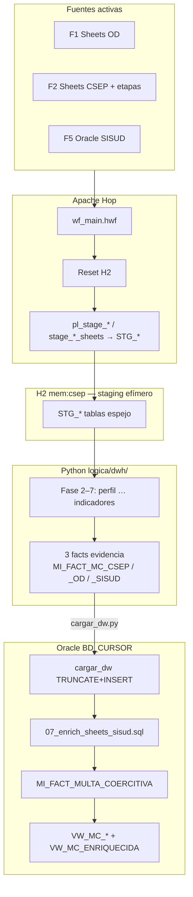
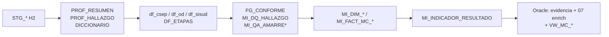
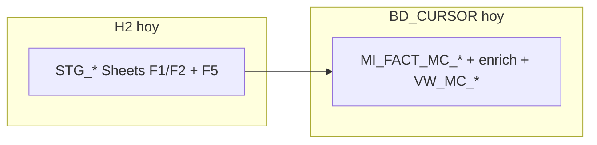

# Status del proyecto — lineamientos Fases 1 a 7

Resumen alineado a [`lineamientos/PROPUESTA_ADAPTADA_ETL.md`](../lineamientos/PROPUESTA_ADAPTADA_ETL.md) (sección 6) y al diseño vigente.  
Rama de trabajo: `fase-1-lineamiento`.  
Manual del fact: [`../lineamientos/extra/manual-como-se-arma-el-fact.md`](../lineamientos/extra/manual-como-se-arma-el-fact.md).  
Guía modelo: [`../adjuntos/guia-leer-modelo-dimensional.md`](../adjuntos/guia-leer-modelo-dimensional.md).

---

## Vista en una corrida



> **F3 OUT.** **F4 MySQL fuera de ingestión** (semilla `GAPPS` en dim fuente únicamente).

---

## Semáforo por fase del lineamiento

| Fase | Qué pide el lineamiento | Status | Evidencia en repo |
|:---:|---|:---:|---|
| **1** | Entorno Python: leer H2, conectar BD_CURSOR, invocado desde Hop | **Listo** | `python/main.py`, `leer_h2.py`, `cargar_dw.py`, `.venv`, `wf_main.hwf` |
| **2** | Perfilamiento + diccionario de las fuentes de multa; evidencia H1–H9 | **Implementado** | `logica/dwh/perfilamiento.py`, `diccionario.py` → `PROF_*`, `DICCIONARIO` |
| **3** | Homologación + dataframes intermedios tipificados (F1/F2/F5, sin merge a un solo fact) | **Implementado** | `homologacion.py`, `integracion.py` → `df_csep` / `df_od` / `df_sisud` / `DF_ETAPAS` |
| **4** | R01–R05, `MI_DQ_HALLAZGO`, % amarre H9 | **Implementado** | `calidad.py` |
| **5** | `DIM_*`, 3× `MI_FACT_MC_*`, `MI_DET_ETAPA_MC` en memoria | **Implementado** | `dimensional.py` |
| **6** | Carga TRUNCATE+INSERT + enrich 07 → `MI_FACT_MULTA_COERCITIVA` | **Implementado** | `python/io/cargar_dw.py`, `ddl/07_enrich_sheets_sisud.sql` |
| **7** | KPIs `MI_INDICADOR_RESULTADO` K1–K5 | **Implementado** | `logica/dwh/indicadores.py`, `ddl/04_indicadores.sql` |
| **8** | Power BI contra BD_CURSOR | **Fuera de alcance** | No se realizará en este repo |

---

## Flujo de datos hoy (Fases 2–7)



| Salida | Fase | Persiste en Oracle |
|---|---|---|
| `PROF_RESUMEN` / `PROF_HALLAZGO` / `DICCIONARIO` | 2 | No — memoria + log |
| Intermedios F1/F2/F5 + `DF_ETAPAS` | 3–4 | No (incluye `FG_CONFORME`) |
| `MI_DQ_HALLAZGO` | 4 | Sí |
| `MI_QA_AMARRE` / `MI_QA_AMARRE_DETALLE` | 4 | Sí |
| `MI_DIM_*` / `MI_FACT_MC_CSEP` / `_OD` / `_SISUD` / `MI_DET_ETAPA_MC` | 5–6 | Sí |
| `MI_FACT_MULTA_COERCITIVA` | 6 (SQL 07) | Sí — (CSEP∪OD) LEFT JOIN SISUD |
| `MI_INDICADOR_RESULTADO` | 7 | Sí |
| `VW_MC_CSEP` / `_OD` / `_SISUD` / `VW_MC_ENRIQUECIDA` | 6 | Sí (vistas) |
| `RESULTADO` | 2–7 | No — resumen de corrida |

---

## Tablas que se crean en cada motor

### H2 (`mem:csep`, puerto 9092) — **sí, en cada corrida**

Se recrean al inicio: `reset_and_create.sh` (DDL base) + `create_stg.py` (DDL staging) + Hop carga filas.

| Tabla | Origen | Quién crea el DDL | Quién carga filas |
|---|---|---|---|
| `DEMO_TABLA_EJEMPLO` | Smoke arquetipo | `h2/sql/01_schema.sql` | Insert fijo en DDL |
| `STG_GS1_CSEP_MULTAS` | F2 Google Sheets CSEP | `create_stg.py` | `pl_stage_csep_sheet.hpl` + `stage_csep_sheets.sh` |
| `STG_GS1_ETAPAS` | F2 Sheets CSEP etapas | `create_stg.py` | `stage_csep_sheets.sh` |
| `STG_GS2_OD_MULTAS` | F1 Google Sheets OD | `create_stg.py` | `pl_stage_od_sheet.hpl` + `stage_ods_sheets.sh` |
| `STG_GS1_DIC_TABLAS` | F2 hoja DIC_TABLAS (Excel legacy) | `create_stg.py` | `pl_stage_excel.hpl` |
| `STG_GS1_DIC_VARIABLES` | F2 hoja DIC_VARIABLES (Excel legacy) | `create_stg.py` | `pl_stage_excel.hpl` |
| `STG_ORA_VW_MULTA_COERCITIVA` | F5 Oracle SISUD | `create_stg.py` | `pl_stage_oracle.hpl` |

H2 es **efímero**: al parar el server o al Reset desaparece todo. No es entregable.

DDL staging generado: `h2/sql/02_stg.sql` (gitignore).

### Oracle REPOCSEP — **no, en el flujo actual**

Conexión legada (`metadata/rdbms/oracle_repocsep.json`, variables `DB_ORA_REPO_*`).  
**Ningún paso de `wf_main.hwf` escribe aquí** tras el refactor a lineamientos Fases 2–3.

### Oracle BD_CURSOR — **sí, Fases 6–7**

Destino del modelo dimensional (`DB_ORA_DW_*` / esquema `APP` local o `REPOCSEP` remote).  
`python/main.py` → `cargar_dw.py` hace wipe + DDL `01`–`06`, INSERT de evidencia/dims/QA/KPIs, y ejecuta enrich 07.

| Grupo | Tablas / vistas |
|---|---|
| Dimensiones | `MI_DIM_TIEMPO`, `MI_DIM_ADMINISTRADO`, `MI_DIM_ORGANO_UNIDAD` (~11), `MI_DIM_OD`, `MI_DIM_FUENTE_REGISTRO`, `MI_DIM_MATERIA_SUBSECTOR`, `MI_DIM_ESTADO`, `MI_DIM_PARAMETRO_UIT` |
| Hechos evidencia | `MI_FACT_MC_CSEP`, `MI_FACT_MC_OD`, `MI_FACT_MC_SISUD`, `MI_DET_ETAPA_MC` |
| Hecho negocio | `MI_FACT_MULTA_COERCITIVA` (SQL 07) |
| Calidad | `MI_DQ_HALLAZGO`, `MI_QA_AMARRE`, `MI_QA_AMARRE_DETALLE` |
| Indicadores | `MI_INDICADOR_RESULTADO` (K1–K5) |
| Vistas reporte | `VW_MC_CSEP`, `VW_MC_OD`, `VW_MC_SISUD`, `VW_MC_ENRIQUECIDA` |



**Conteos de referencia:** CSEP~990 · OD~281 · SISUD~534 · enriquecido~1271.

---

## Fuentes y staging

| ID | Fuente | STG H2 | Carga Hop | Notas |
|---|---|---|:---:|---|
| F1 | Google Sheets OD | `STG_GS2_OD_MULTAS` | Sí | `stage_ods_sheets.sh` |
| F2 | Google Sheets CSEP | `STG_GS1_CSEP_MULTAS` / `ETAPAS` | Sí | `stage_csep_sheets.sh` |
| F2 | DIC (Excel legacy) | `STG_GS1_DIC_*` | Sí | `pl_stage_excel.hpl` |
| F3 | Informes SISUD | — | **No** | Fuera de alcance |
| F4 | MySQL GAPP | — | **No** | Fuera de ingestión; semilla `GAPPS` en dim |
| F5 | SISUD vista multas | `STG_ORA_VW_*` | Sí | credenciales Oracle |

---

## Qué se eliminó vs. enfoque anterior

| Antes (medallion TDR) | Ahora (lineamientos) |
|---|---|
| `logica/fase1/` → `INT_*`, `QA_*` | `logica/dwh/` → `PROF_*`, intermedios, `MI_*` |
| `output/fase1.xlsx` + carga `INT_*` Oracle | `cargar_dw.py` → evidencia + enrich + `VW_MC_*` |
| Modelo por universo sin cruce | 3 facts evidencia + enrich Sheet←SISUD; amarre H9 `RES_MONTO_Sheets_vs_SISUD` |

---

## Cómo verificar

```bash
./init.sh   # HARNESS OK
```

Detalle: [`../verification.md`](../verification.md) · modelo: [`../adjuntos/guia-leer-modelo-dimensional.md`](../adjuntos/guia-leer-modelo-dimensional.md).

---

## Alcance del lineamiento

Fases 1–7 + infra staging: **cerradas**. Fase 8 (Power BI): **fuera de alcance** — no se realizará.
