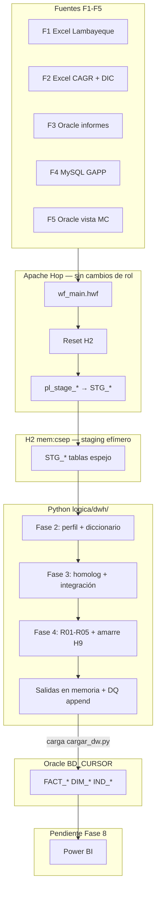
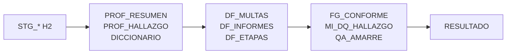
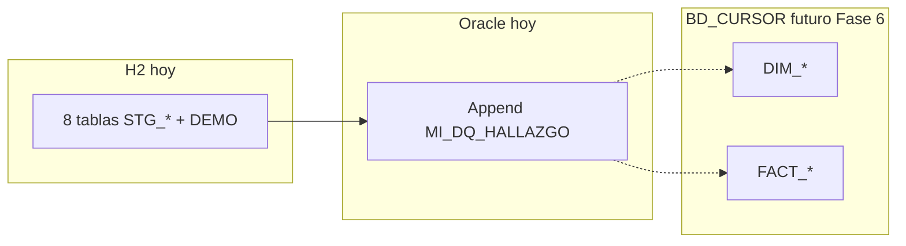

# Status del proyecto — lineamientos Fases 1 a 7

Resumen alineado a [`lineamientos/PROPUESTA_ADAPTADA_ETL.md`](../lineamientos/PROPUESTA_ADAPTADA_ETL.md) (sección 6).  
Rama de trabajo: `fase-1-lineamiento`.

---

## Vista en una corrida



---

## Semáforo por fase del lineamiento

| Fase | Qué pide el lineamiento | Status | Evidencia en repo |
|:---:|---|:---:|---|
| **1** | Entorno Python: leer H2, conectar BD_CURSOR, invocado desde Hop | **Listo** | `python/main.py`, `leer_h2.py`, `escribir_dw.py`, `.venv`, `wf_main.hwf` |
| **2** | Perfilamiento + diccionario de las 5 fuentes; evidencia H1–H9 | **Implementado** | `logica/dwh/perfilamiento.py`, `diccionario.py` → `PROF_*`, `DICCIONARIO` |
| **3** | Homologación + dataframes integrados tipificados en memoria | **Implementado** | `homologacion.py`, `integracion.py` → `DF_MULTAS`, `DF_INFORMES`, `DF_ETAPAS` |
| **4** | R01–R05, `MI_DQ_HALLAZGO`, % amarre H9 | **Implementado** | `calidad.py` |
| **5** | `DIM_*`, `FACT_*`, `MI_DET_ETAPA_MC` en memoria | **Implementado** | `dimensional.py` |
| **6** | Carga TRUNCATE+INSERT a BD_CURSOR | **Implementado** | `python/io/cargar_dw.py` |
| **7** | KPIs `MI_INDICADOR_RESULTADO` K1–K5 | **Implementado** | `logica/dwh/indicadores.py`, `ddl/04_indicadores.sql` |
| **8+** | Power BI contra BD_CURSOR | **Pendiente** | Fase 8 lineamiento |

---

## Flujo de datos hoy (Fases 1–4)



| Salida | Fase | Persiste en disco/Oracle |
|---|---|---|
| `PROF_RESUMEN` | 2 | No — memoria + log |
| `PROF_HALLAZGO` | 2 | No |
| `DICCIONARIO` | 2 | No |
| `DF_MULTAS` | 3–4 | No (incluye `FG_CONFORME`) |
| `DF_INFORMES` | 3–4 | No (incluye `FG_CONFORME`) |
| `DF_ETAPAS` | 3 | No |
| `MI_DQ_HALLAZGO` | 4 | Append a BD_CURSOR si credenciales OK |
| `QA_AMARRE` | 4 | No — memoria + log |
| `RESULTADO` | 2–4 | No — resumen de corrida |

---

## Tablas que se crean en cada motor

### H2 (`mem:csep`, puerto 9092) — **sí, en cada corrida**

Se recrean al inicio: `reset_and_create.sh` (DDL base) + `create_stg.py` (DDL staging) + Hop carga filas.

| Tabla | Origen | Quién crea el DDL | Quién carga filas |
|---|---|---|---|
| `DEMO_TABLA_EJEMPLO` | Smoke arquetipo | `h2/sql/01_schema.sql` | Insert fijo en DDL |
| `STG_GS1_MULTAS_COERCITIVAS` | F2 Excel CAGR | `create_stg.py` | `pl_stage_excel.hpl` |
| `STG_GS1_ETAPAS` | F2 Excel etapas | `create_stg.py` | `pl_stage_excel.hpl` |
| `STG_GS2_MULTAS_COERCITIVAS` | F1 Excel Lambayeque | `create_stg.py` | `pl_stage_excel.hpl` |
| `STG_GS1_DIC_TABLAS` | F2 hoja DIC_TABLAS | `create_stg.py` | Pendiente en Hop* |
| `STG_GS1_DIC_VARIABLES` | F2 hoja DIC_VARIABLES | `create_stg.py` | Pendiente en Hop* |
| `STG_ORA_VW_MULTA_COERCITIVA` | F5 Oracle SISUD | `create_stg.py` | `pl_stage_oracle.hpl` |
| `STG_ORA_CSEP_INFORMES` | F3 Oracle SISUD | `create_stg.py` | `pl_stage_informes.hpl` |
| `STG_MYSQL_T_MVC_MULTACOERCITIVA` | F4 MySQL GAPP | `create_stg.py` | `pl_stage_mysql.hpl` |

\* DIC: el diccionario también puede leerse desde Excel en Python si STG vacío (`logica/dwh/diccionario.py`).

H2 es **efímero**: al parar el server o al Reset desaparece todo. No es entregable.

DDL staging generado: `h2/sql/02_stg.sql` (gitignore).

### Oracle REPOCSEP — **no, en el flujo actual**

Conexión legada (`metadata/rdbms/oracle_repocsep.json`, variables `DB_ORA_REPO_*`).  
**Ningún paso de `wf_main.hwf` escribe aquí** tras el refactor a lineamientos Fases 2–3.

### Oracle BD_CURSOR — **no en Fases 1–3; definido para Fase 6+**

Destino del modelo dimensional según lineamientos (`DB_ORA_DW_*` / esquema `APP`).  
**La corrida actual no crea ni carga tablas** — `python/main.py` solo deja DataFrames en memoria.

Tablas previstas (DDL en [`lineamientos/ddl/`](../lineamientos/ddl/)), **pendientes de implementar**:

| Grupo | Tablas |
|---|---|
| Dimensiones | `MI_DIM_TIEMPO`, `MI_DIM_ADMINISTRADO`, `MI_DIM_ORGANO_UNIDAD`, `MI_DIM_MATERIA_SUBSECTOR`, `MI_DIM_ESTADO`, `MI_DIM_PARAMETRO_UIT` |
| Hechos | `MI_FACT_MULTA_COERCITIVA`, `MI_FACT_INFORME_SUPERVISION`, `MI_DET_ETAPA_MC` |
| Calidad | `MI_DQ_HALLAZGO` (Fase 4+) |
| Indicadores | `MI_INDICADOR_RESULTADO` (Fase 7) |

El módulo [`python/io/cargar_dw.py`](../../python/io/cargar_dw.py) aplica DDL formal, elimina vistas `VW_FCT_*` legacy y carga `DIM_*`/`FACT_*`/`DET_*`/`MI_DQ_HALLAZGO` con TRUNCATE+INSERT.



---

## Fuentes y staging

| ID | Fuente | STG H2 | Carga Hop | Notas |
|---|---|---|:---:|---|
| F1 | Excel Lambayeque | `STG_GS2_*` | Sí | `pl_stage_excel` |
| F2 | Excel CAGR multas/etapas | `STG_GS1_*` | Sí | |
| F2 | DIC_TABLAS / DIC_VARIABLES | `STG_GS1_DIC_*` | Parcial | DDL + `create_stg`; Hop Excel pendiente cablear |
| F3 | SISUD informes | `STG_ORA_CSEP_INFORMES` | Sí* | *Requiere credenciales Oracle |
| F4 | MySQL GAPP | `STG_MYSQL_*` | Sí* | *Requiere credenciales MySQL |
| F5 | SISUD vista multas | `STG_ORA_VW_*` | Sí* | *Requiere credenciales Oracle |

`create_stg.py` exige credenciales Oracle/MySQL válidas (`require_live_conn`); falla si faltan o son placeholder.

---

## Qué se eliminó vs. enfoque anterior

| Antes (medallion TDR) | Ahora (lineamientos) |
|---|---|
| `logica/fase1/` → `INT_*`, `QA_*` | `logica/dwh/` → `PROF_*`, `DF_*` |
| `output/fase1.xlsx` + carga `INT_*` Oracle | Sin Excel ni carga dimensional en corrida |
| Modelo por universo sin cruce | Integración F1+F2+F4+F5 con `FUENTE_ORIGEN` |

---

## Cómo verificar

```bash
./h2/scripts/reset_and_create.sh
.venv/bin/python python/create_stg.py
# Opcional: wf_main.hwf en Hop para cargar filas
.venv/bin/python python/main.py
```

Detalle técnico: [`lineamientos/implementacion-fase-2-3.md`](../lineamientos/implementacion-fase-2-3.md).

---

## Próximo hito (Fase 8 del lineamiento)

Validar tablero Power BI contra `MI_INDICADOR_RESULTADO` y tablas `DIM_*`/`FACT_*` en BD_CURSOR.
