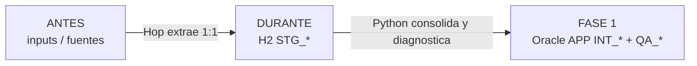
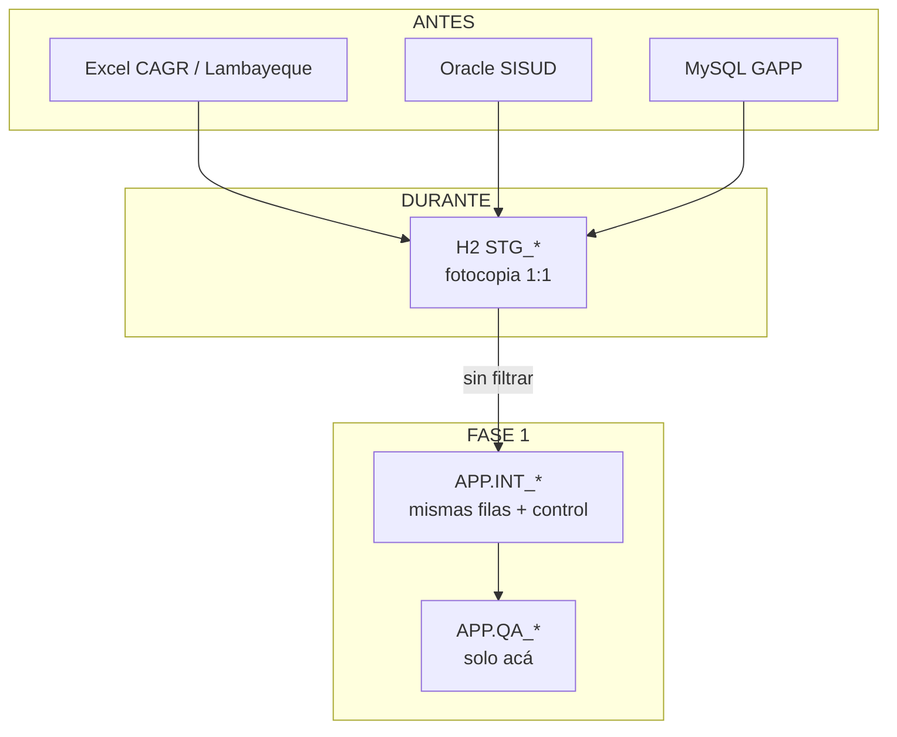

# Antes → durante → fase 1

Dónde viven los datos en cada momento de una corrida de `wf_main`, y **en qué se diferencian**.

Nombres: [`../glosario.md`](../glosario.md). Vista general: [`../vista-general.md`](../vista-general.md). Status: [`status.md`](status.md).

Hay **tres momentos**, no tres copias idénticas de la misma base.



| Momento | Dónde | Qué hay | Para qué |
|---|---|---|---|
| **Antes** | Excel, Oracle **SISUD**, MySQL GAPP | Los sistemas de origen | Operar el negocio; el ETL no los toca |
| **Durante** | H2 `mem:csep` (puerto 9092) | Tablas `STG_*` | Fotocopia de **esta** corrida, para que Python lea |
| **Fase 1** | Oracle **BD_CURSOR** `APP` (puerto 1524) | Tablas `INT_*` + `QA_*` | Entregable: consolidado + diagnóstico |

Oracle **SISUD** (antes) y Oracle **BD_CURSOR** (fase 1) **no son el mismo Oracle**.

## H2 vs Oracle destino

Olvida por un momento que H2 se borra. Imagina que las dos bases quedan abiertas. **No ves lo mismo.**

### 1. Ni siquiera hay las mismas tablas

```text
H2 (mem:csep)                         Oracle APP (BD_CURSOR)
─────────────────────────────         ─────────────────────────────
STG_GS1_MULTAS_COERCITIVAS   16       INT_MC_EXCEL                 37
STG_GS2_MULTAS_COERCITIVAS   21         (GS1 y GS2 ya van JUNTOS)
STG_GS1_ETAPAS               55       INT_MC_ETAPAS                55
STG_ORA_VW_MULTA_COERCITIVA 530       INT_MC_SISUD                530
STG_MYSQL_T_MVC_...           4       INT_MC_GAPP                   4
STG_ORA_CSEP_INFORMES     53288       INT_INFORMES              53288

(no hay QA)                           QA_CORRIDA                   11
(no hay INT_)                         QA_EXCEPCION               5480
```

En H2 **no existe** `INT_MC_EXCEL`. En Oracle **no existe** `STG_GS1_MULTAS_COERCITIVAS`.
Son catálogos distintos, no una réplica.

### 2. Excel: H2 guarda dos cajones; Oracle uno solo con etiqueta

H2 respeta el extract: CAGR en una tabla, Lambayeque en otra.

Oracle destino **une** esas 16+21 filas en `INT_MC_EXCEL` y marca de dónde vino cada una:

| ID_CORRIDA | FUENTE | COD_MA | … |
|---|---|---|---|
| 20260818195022 | GS1_CAGR | … | fila que en H2 estaba en `STG_GS1_*` |
| 20260818195022 | GS2_LAMBAYEQUE | … | fila que en H2 estaba en `STG_GS2_*` |

`ID_CORRIDA` y `FUENTE` **no están en H2**. Las pone Python al consolidar.

### 3. El diagnóstico solo vive en Oracle

H2 no sabe si `COD_MA` está duplicado ni si un monto no parsea.

Eso se calcula **después** de leer H2 y se guarda en `APP.QA_CORRIDA` / `APP.QA_EXCEPCION` (5480 hallazgos en la última corrida). Si solo miras H2, ese entregable **no está**.

### 4. Entonces, ¿qué es “lo mismo”?

Solo el **conteo de filas de negocio** (fase 1 no borra): 530 multas SISUD acá y 530 allá.

Eso no convierte a Oracle en “H2 persistente”. Oracle es **otra capa**: une, etiqueta y audita. H2 es el extract crudo para que Python tenga de dónde leer.

La volatilidad de H2 es un detalle de infraestructura (in-memory). Aunque H2 fuera un disco permanente, **seguiría siendo staging**, no el destino.

---

## Antes — los inputs

Viven fuera del ETL. Se declaran en [`../inputs.yaml`](../inputs.yaml). Hop **lee**; no escribe ahí.

| Input | Tipo | Objeto | Universo |
|---|---|---|---|
| CAGR «1) Multas coercitivas» | Excel | `input_excel/CAGR_ MA OEFA - 3) MULTAS COERCITIVAS.xlsx` | Multas (GS1) |
| CAGR «2) Etapas» | Excel | mismo archivo | Etapas de multa |
| Lambayeque «5) Multas Coercitivas» | Excel | `input_excel/MEDIDAS ADMINISTRATIVAS OD LAMBAYEQUE.xlsx` | Multas (GS2) |
| SISUD | Oracle fuente | `SISUD.VW_MULTA_COERCITIVA` | Multas (expediente) |
| SISUD | Oracle fuente | `SISUD.CSEP_INFORMES_VIEW` | Informes de supervisión |
| GAPP | MySQL | `gappsdb.T_MVC_MULTACOERCITIVA_MC` | Multas (otro grano) |

**Antes** el dato sigue en su forma nativa: Excel con `#N/A` y textos, SISUD con tipos Oracle, MySQL con tipos propios. No hay `ID_CORRIDA`. No hay QA.

---

## Durante — H2

Landing bronze **efímero**. Cada Play de `wf_main` resetea H2, crea `STG_*` vacías y Hop las llena.

| Tabla H2 | Copia de | Filas (corrida `20260818195022`) |
|---|---|---|
| `STG_GS1_MULTAS_COERCITIVAS` | Excel CAGR multas | 16 |
| `STG_GS1_ETAPAS` | Excel CAGR etapas | 55 |
| `STG_GS2_MULTAS_COERCITIVAS` | Excel Lambayeque | 21 |
| `STG_ORA_VW_MULTA_COERCITIVA` | Vista SISUD multas | 530 |
| `STG_ORA_CSEP_INFORMES` | Vista SISUD informes | 53288 |
| `STG_MYSQL_T_MVC_MULTACOERCITIVA` | Tabla GAPP | 4 |

Reglas de **durante**:

- Una fuente → una `STG_*`. Sin UNION. Sin filtrar.
- Misma forma que el extract (Excel todo `VARCHAR`; SISUD/MySQL con tipos que trajo Hop).
- No hay `INT_*` ni `QA_*` en H2.
- Si se para el server H2, esto **desaparece**.

---

## Fase 1 — Oracle `APP` (BD_CURSOR)

Destino persistente del entregable 1. Python lee H2, arma `INT_*` / `QA_*`, y escribe aquí (y a [`../output/fase1.xlsx`](../output/fase1.xlsx)).

| Tabla `APP` | Sale de | Filas | Qué cambió vs H2 |
|---|---|---|---|
| `INT_MC_EXCEL` | GS1 + GS2 | 37 | UNION de dos `STG_*`; columnas `ID_CORRIDA`, `FUENTE` |
| `INT_MC_ETAPAS` | `STG_GS1_ETAPAS` | 55 | Solo control (`ID_CORRIDA`, `FUENTE`) |
| `INT_MC_SISUD` | `STG_ORA_VW_MULTA_COERCITIVA` | 530 | Solo control |
| `INT_MC_GAPP` | `STG_MYSQL_T_MVC_*` | 4 | Solo control |
| `INT_INFORMES` | `STG_ORA_CSEP_INFORMES` | 53288 | Solo control |
| `QA_CORRIDA` | Diagnóstico (no hay en H2) | 11 por corrida | Conteos OK/WARN |
| `QA_EXCEPCION` | Diagnóstico (no hay en H2) | 5480 esta corrida | Hallazgos fila a fila |

`INT_*` se **truncan** cada corrida (queda la última). `QA_*` se **acumulan** por `ID_CORRIDA`.

---

## La diferencia (en una tabla)

| | Antes (inputs) | Durante (H2) | Fase 1 (Oracle `APP`) |
|---|---|---|---|
| **Pregunta que responde** | ¿De dónde salió? | ¿Qué se extrajo hoy? | ¿Qué consolidamos y qué calidad tiene? |
| **Dueño** | Sistemas OEFA / archivos | ETL (memoria) | Entregable / DW de trabajo |
| **Se puede escribir** | No (solo lectura) | Sí, Hop truncate+insert | Sí, Python TRUNCATE `INT_` / APPEND `QA_` |
| **Granularidad** | Cada sistema por su lado | Una tabla por fuente | Universos (`INT_MC_EXCEL` ya une GS1+GS2) |
| **Filas de negocio** | Las vivas en origen | Foto 1:1 de esa foto | Las mismas: **no se borra nada** |
| **Columnas extra** | Ninguna del ETL | Ninguna | `ID_CORRIDA`, `FUENTE` |
| **Calidad** | No medida | No medida (la copia es fiel, defectos incluidos) | Medida en `QA_*` (`WARN`, no se descarta) |
| **Tipos** | Nativos de cada fuente | Casi nativos del extract | Casi todo `VARCHAR2(4000)` / `TIMESTAMP` |
| **Vida** | Permanente en origen | Hasta el próximo reset / stop H2 | Permanente en `APP` |
| **Si cambia el origen mañana** | Cambia ahí | No, hasta el próximo Play | No, hasta el próximo Play |



## Qué no confundir

1. **Mismas filas ≠ mismo objeto.** 53288 en H2 y 53288 en `INT_INFORMES` es el invariante de a). No es la misma tabla replicada.
2. **Dos Oracle.** SISUD = input. `APP@BD_CURSOR` = fase 1. El ETL no escribe en SISUD.
3. **H2 no es el entregable.** Es el paso intermedio. El entregable 1 es `APP` + `output/fase1.xlsx`.
4. **QA no “arregla”.** Lista defectos. Las filas malas siguen en `INT_*` (fase 1 no depura; eso es fase 2).
