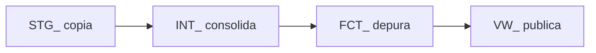

# Glosario

Nombres cortos que usa este ETL. Dónde vive cada dato (antes / H2 / Oracle): [`antes-durante-fase1.md`](antes-durante-fase1.md). Vista de fase 1: [`fase-1-vista.md`](fase-1-vista.md). Detalle: [`fase-1.md`](fase-1.md).

El `_` al final (`STG_`, `INT_`) significa “todas las tablas de esa capa”.

## Capas (prefijos)

| Término | Qué es, en una frase |
|---|---|
| **STG_** | Staging en H2: copia 1:1 de cada fuente. Sin UNION, sin `ID_CORRIDA`, sin QA. |
| **INT_** | Intermediate en Oracle `APP`: consolidado **sin filtrar**, con `ID_CORRIDA` y `FUENTE`. |
| **QA_** | Control en Oracle `APP` (no hay QA en H2): conteos y hallazgos, no datos de negocio. |
| **FCT_** | Fact: hecho depurado y tipado. **Fase 2**, aún no existe. |
| **VW_** | Vista publicada (solo filas válidas). **Fase 2**. |
| **IND_** | Indicadores agregados. **Fase 2–3**. |

## Tablas de control

| Término | Qué es, en una frase |
|---|---|
| **QA_CORRIDA** | Una fila por corrida, capa y fuente: cuántas filas, nulos, duplicados, OK/WARN. |
| **QA_EXCEPCION** | Una fila por hallazgo (llave vacía, duplicado, fecha o monto ilegible). |
| **ID_CORRIDA** | Identificador de esa ejecución (`YYYYMMDDHHMMSS`). Sirve para no mezclar corridas. |
| **CHECK_STS** | Resultado del control: `OK` o `WARN`. Nunca tumba el pipeline. |
| **FG_VALIDO** | Marca S/N en el hecho. **Fase 2**; en fase 1 no se usa. |

## Dónde vive

| Término | Qué es, en una frase |
|---|---|
| **H2** | Workbench de la corrida (puerto 9092): solo `STG_*`. No es el entregable. |
| **BD_CURSOR** | Oracle destino (puerto 1524, `APP`): `INT_*` + `QA_*`. Ahí está la fase 1. |
| **LECTURAS** | Nombres de los DataFrames que lee Python desde H2 (`GS1`, `ORA`, `MYSQL`…). |
| **RESULTADO** | Portada del Excel: copia de `QA_CORRIDA`. |

## Fuentes (nombres cortos)

| Término | Qué es, en una frase |
|---|---|
| **GS1 / GS2** | Hojas Excel CAGR y Lambayeque (multas). |
| **SISUD** | Oracle fuente de la vista de multas (`VW_MULTA_COERCITIVA`). |
| **GAPP** | MySQL de multas coercitivas. |
| **MC** | Multa coercitiva (en nombres tipo `INT_MC_EXCEL`). |
