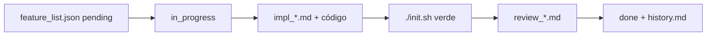

# Workflow multi-agente (adaptado a Cursor)

Patrón inspirado en [ejemplo-harness-subagentes](https://github.com/nwoswo/ejemplo-harness-subagentes): **estado en disco**, **una feature a la vez**, **verificación ejecutable**.

En Cursor no hace falta `.claude/agents/`; los roles se mapean así:

| Rol | Quién | Hace | No hace |
|---|---|---|---|
| **Líder** | Usuario o agente principal | Elige feature, actualiza `progress/current.md`, lanza subagentes | Implementación masiva de lógica |
| **Implementador** | Task `generalPurpose` con scope acotado | Código + `progress/impl_<id>.md` + `./init.sh` | Auto-aprobarse |
| **Revisor** | Task `bugbot` o checklist manual | `progress/review_<id>.md` vs CHECKPOINTS | Editar código |

## Regla anti-teléfono-descompuesto

Los subagentes **escriben en archivos** y devuelven solo una referencia:

```text
done -> progress/impl_<feature-id>.md
```

No pegar logs largos en chat; viven en `progress/` y quedan versionados.

## Ciclo por feature



1. Elegir una feature `pending` en [`feature_list.json`](../../feature_list.json).
2. Pasar a `in_progress` (solo una).
3. Implementar; documentar en `progress/impl_<id>.md`:
   - Archivos tocados
   - Output relevante de `./init.sh`
   - Consultas SQL si aplica
4. Revisor valida contra [`CHECKPOINTS.md`](../../CHECKPOINTS.md).
5. Si OK → `done`; append resumen en [`progress/history.md`](../../progress/history.md); limpiar o resetear `progress/current.md`.

## Alcance por feature

Las fases 5–7 del lineamiento tocaron muchos archivos acoplados; **a partir de ahora** conviene granularidad en `feature_list.json` (features infra pequeñas: rename, Windows, remote). Fase 8 Power BI está **fuera de alcance**.

## Skills de dominio (no reemplazan el harness)

- [`hop-python-etl`](../../.agents/skills/hop-python-etl/SKILL.md) — Hop/H2/Python
- [`phased-dwh-lineamiento`](../../.agents/skills/phased-dwh-lineamiento/SKILL.md) — fases 2–7
- [`auditable-soft-quarantine`](../../.agents/skills/auditable-soft-quarantine/SKILL.md) — DQ
- [`oracle-cargar-dw`](../../.agents/skills/oracle-cargar-dw/SKILL.md) — carga Oracle

El harness responde *cómo trabajar semanas sin perder el hilo*; las skills responden *qué construir*.
