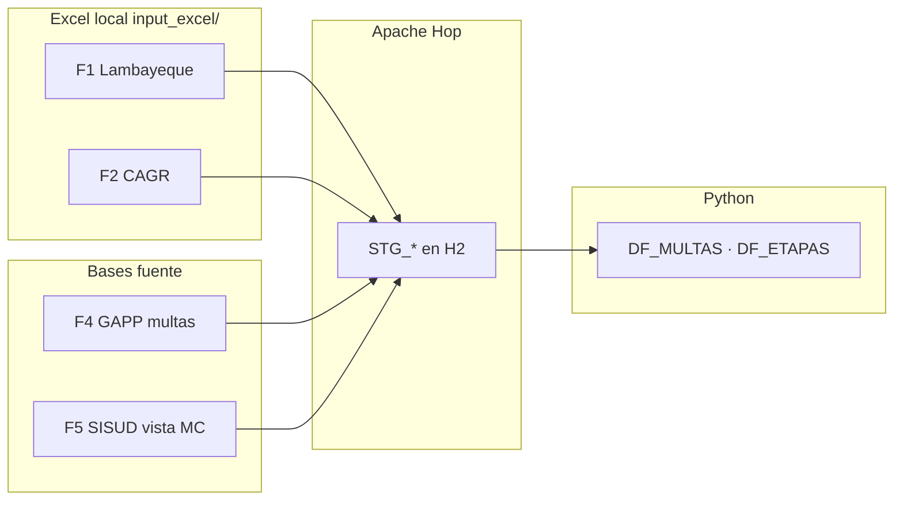

# Inputs del ETL — alcance actual

Inventario de las fuentes que alimentan el pipeline **Hop → H2 (`STG_*`) → Python → Oracle DW (`MI_*`)**.

Este data warehouse es **solo Multas**. F3 (informes de supervisión / `CSEP_INFORMES_VIEW`) **no entra** en Hop, Kimball ni Oracle.

Manifiesto canónico: [`../../inputs.yaml`](../../inputs.yaml).  
Detalle campo a campo: [`../lineamientos/ANEXO_MAPEO_CAMPOS.md`](../lineamientos/ANEXO_MAPEO_CAMPOS.md) y [`../lineamientos/extra/fuentes_datos/01-fuentes-de-datos.md`](../lineamientos/extra/fuentes_datos/01-fuentes-de-datos.md).

---

## Alcance validado a la fecha

El modelo dimensional y los indicadores K1–K5 se construyen con:

| Universo | Fuente | Estado |
|---|---|---|
| **1 OD / región** | F1 — Excel Lambayeque | En uso |
| **1 unidad (CAGR)** | F2 — Excel multas + etapas de una coordinación | En uso |
| **Conciliación multas** | F4 — MySQL GAPP | En uso |
| **Vista institucional multas** | F5 — Oracle SISUD | En uso |

**Fuera de alcance:** F3 — Oracle SISUD informes (`CSEP_INFORMES_VIEW`).

**Pendiente de incorporar** (sin reprocesar aún en esta carpeta): las **31 regiones/departamentos restantes** (otros libros Excel tipo F1) y las **9 unidades restantes** del universo CAGR (otros libros/hojas tipo F2). Requiere confirmación del modelo dimensional antes de ampliar.

---

## Flujo de inputs

---

## Resumen por fuente (F1, F2, F4, F5)

| ID | Nombre corto | Dominio | Pestaña Excel | Tipo | Origen | Tabla STG | Pipeline Hop | Uso en el DW |
|---|---|---|---|---|---|---|---|---|
| **F1** | Lambayeque | **Multas** | `5) Multas Coercitivas` | Excel | `MEDIDAS ADMINISTRATIVAS OD LAMBAYEQUE.xlsx` | `STG_GS2_MULTAS_COERCITIVAS` | `pl_stage_excel.hpl` | Hecho multa (`MI_FACT_MULTA_COERCITIVA`) |
| **F2** | CAGR multas | **Multas** | `1) Multas coercitivas` | Excel | `CAGR_ MA OEFA - 3) MULTAS COERCITIVAS.xlsx` | `STG_GS1_MULTAS_COERCITIVAS` | `pl_stage_excel.hpl` | Hecho multa |
| **F2-ET** | CAGR etapas | **Multas** (detalle) | `2) Etapas` | Excel | mismo archivo F2 | `STG_GS1_ETAPAS` | `pl_stage_excel.hpl` | Detalle `MI_DET_ETAPA_MC` |
| **F2-DIC** | Diccionario | Apoyo (no hecho) | `DIC_TABLAS` / `DIC_VARIABLES` | Excel | mismo archivo F2 | `STG_GS1_DIC_TABLAS`, `STG_GS1_DIC_VARIABLES` | `pl_stage_excel.hpl`* | Perfilamiento y diccionario de campos |
| **F4** | GAPP multas | **Multas** (conciliación) | — | MySQL | `gappsdb.T_MVC_MULTACOERCITIVA_MC` | `STG_MYSQL_T_MVC_MULTACOERCITIVA` | `pl_stage_mysql.hpl` | Conciliación CUM/CAM, estados, SIGED |
| **F5** | SISUD vista MC | **Multas** | — | Oracle | `SISUD.VW_MULTA_COERCITIVA` | `STG_ORA_VW_MULTA_COERCITIVA` | `pl_stage_oracle.hpl` | Expediente, resolución, CUM/CAM |

**Dominio:** **Multas** alimenta `DF_MULTAS` / `MI_FACT_MULTA_COERCITIVA`. F2-ET y F2-DIC son apoyo al universo de multas.

\* Hojas DIC: DDL y `create_stg.py` listos; verificar cableado completo en Hop según entorno.

Los IDs F4 y F5 se conservan (no se renumeran). F3 queda hueco a propósito.

---

## Archivos Excel en uso (`input_excel/`)

Los libros físicos viven en la raíz del proyecto (`input_excel/`, gitignored salvo notas). Hoy hay **dos archivos**:

| Archivo | Fuente | Hoja(s) usadas por el ETL | `header_row` |
|---|---|---|---|
| `MEDIDAS ADMINISTRATIVAS OD LAMBAYEQUE.xlsx` | F1 | `5) Multas Coercitivas` | 3 |
| `CAGR_ MA OEFA - 3) MULTAS COERCITIVAS.xlsx` | F2 / F2-ET / F2-DIC | `1) Multas coercitivas`, `2) Etapas`, `DIC_TABLAS`, `DIC_VARIABLES` | 3 / 2 / 1 / 1 |

Convención Excel: fila `header_row` = nombres técnicos de columna; datos desde la fila siguiente.

---

## Fuentes remotas (F4, F5)

No van en esta carpeta; se leen por JDBC en Hop según `project-config.json` / `environments/*.json`.

| ID | Conexión Hop | Esquema / base | Objeto |
|---|---|---|---|
| F4 | `mysql` | `gappsdb` | `T_MVC_MULTACOERCITIVA_MC` |
| F5 | `oracle_sisud` | `SISUD` | `VW_MULTA_COERCITIVA` |

Credenciales: [`../credenciales/`](../credenciales/) o `environments/local.json` / `remote.json` (no versionar secretos).

---

## Integración en Python

Tras el staging, `logica/dwh/` consume las lecturas H2 (`GS1`, `GS2`, `ORA`, `MYSQL`, `ETAPAS`):

| Salida intermedia | Fuentes que integra |
|---|---|
| `DF_MULTAS` | F1 + F2 + F4 + F5 (`FUENTE_ORIGEN`: `LAM_OD`, `CAGR`, `GAPPS`, `SISUD_VW`) |
| `DF_ETAPAS` | F2-ET |

Amarre H9: puentes entre fuentes de **multa** (COD_MA, CUM F4↔F5). No hay cruce multa↔informe.

Mapa en código: [`../../logica/dwh/constantes.py`](../../logica/dwh/constantes.py) (`STG_FUENTE`, `FUENTE_REGISTRO`).

---

## Cómo añadir una región o unidad nueva

1. Colocar el `.xlsx` en `input_excel/` (o ruta acordada con CSEP).
2. Registrar entrada en [`../../inputs.yaml`](../../inputs.yaml) (`stg_table`, `path`, `worksheet`, `header_row`).
3. Ejecutar `python/create_stg.py` (DDL H2) y cablear/ajustar `pl_stage_excel.hpl` si hace falta.
4. Correr `wf_main` / `wf_main_win` y validar conteos `STG_*` → hechos `MI_*`.

Antes de procesar en masa las 31 regiones y 9 unidades restantes, confirmar el modelo dimensional vigente (ver [`../adjuntos/modelo-kimball.md`](../adjuntos/modelo-kimball.md)).

---

## Referencias

- Antes / durante / staging: [`../antes-durante-fase1.md`](../antes-durante-fase1.md)
- Modelo Kimball e inputs: [`../adjuntos/modelo-kimball.md`](../adjuntos/modelo-kimball.md) §0
- Estado fases: [`../fase1-3/status.md`](../fase1-3/status.md)
