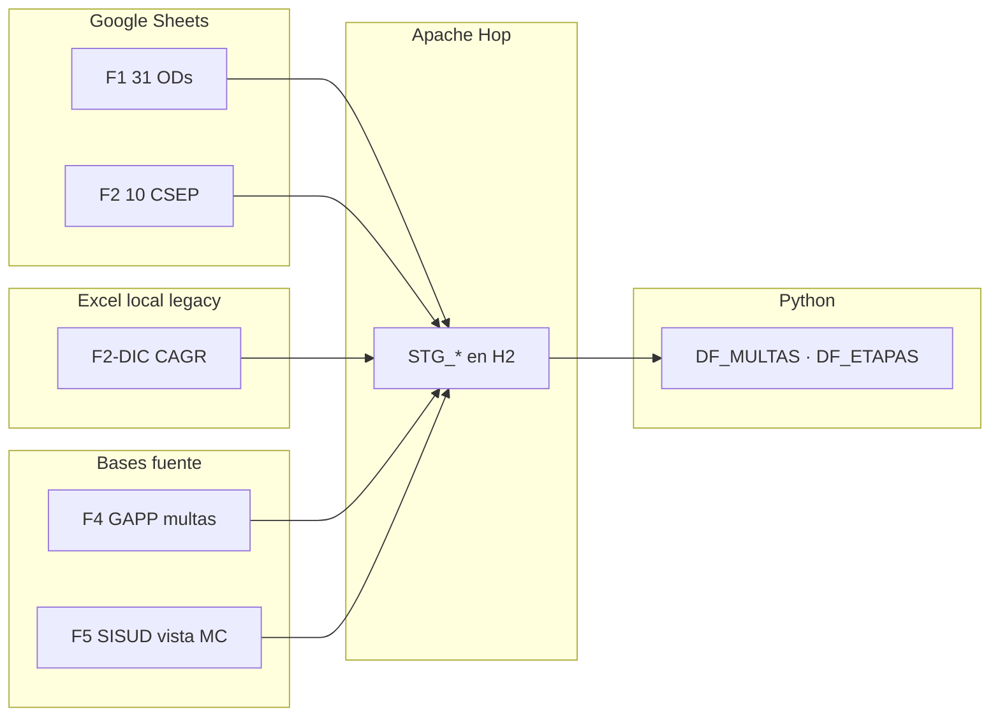

# Inputs del ETL — alcance actual

Inventario de las fuentes que alimentan el pipeline **Hop → H2 (`STG_*`) → Python → Oracle DW (`MI_*`)**.

Este data warehouse es **solo Multas**. F3 (informes de supervisión / `CSEP_INFORMES_VIEW`) **no entra** en Hop, Kimball ni Oracle.

Manifiesto canónico: [`../../inputs.yaml`](../../inputs.yaml).  
Catálogo F1 ODs (Google Sheets): [`f1_ods_sheets.json`](f1_ods_sheets.json).  
Catálogo F2 CSEP (Google Sheets): [`f2_csep_sheets.json`](f2_csep_sheets.json).  
Detalle campo a campo: [`../lineamientos/ANEXO_MAPEO_CAMPOS.md`](../lineamientos/ANEXO_MAPEO_CAMPOS.md) y [`../lineamientos/extra/fuentes_datos/01-fuentes-de-datos.md`](../lineamientos/extra/fuentes_datos/01-fuentes-de-datos.md).

---

## Alcance validado a la fecha

| Universo | Fuente | Estado |
|---|---|---|
| **31 ODs** | F1 — Google Sheets medidas administrativas | Catálogo JSON + Hop `GoogleSheetsInput` |
| **10 unidades CSEP** | F2 — Google Sheets multas + etapas (10 activas) | Catálogo JSON + Hop |
| **Conciliación multas** | F4 — MySQL GAPP | En uso |
| **Vista institucional multas** | F5 — Oracle SISUD | En uso |

**Fuera de alcance:** F3 — Oracle SISUD informes; consolidados F1 (`CONSOLIDADO MEDIDAS ADMINISTRATIVAS` / `… CSEP`); unidad CODE (solo en `MI_DIM_OD`, sin sheet).

---

## Flujo de inputs

---

## Resumen por fuente (F1, F2, F4, F5)

| ID | Nombre corto | Dominio | Pestaña | Tipo | Origen | Tabla STG | Pipeline Hop | Uso en el DW |
|---|---|---|---|---|---|---|---|---|
| **F1** | Familia OD | **Multas** | `5) Multas Coercitivas` | Google Sheets | [`f1_ods_sheets.json`](f1_ods_sheets.json) | `STG_GS2_OD_MULTAS` (+ `COD_OD`) | `pl_stage_od_sheet.hpl` vía `scripts/stage_ods_sheets.sh` | Hecho multa + `ID_OD` |
| **F2** | CSEP multas | **Multas** | `1) Multas coercitivas` | Google Sheets | [`f2_csep_sheets.json`](f2_csep_sheets.json) | `STG_GS1_CSEP_MULTAS` (+ `COD_UNIDAD`) | `pl_stage_csep_sheet.hpl` vía `scripts/stage_csep_sheets.sh` | Hecho multa (`FUENTE_REGISTRO=CAGR`, unidad vía `COORD`) |
| **F2-ET** | CSEP etapas | **Multas** (detalle) | `2) Etapas` | Google Sheets | mismo catálogo F2 | `STG_GS1_ETAPAS` | `pl_stage_csep_etapa.hpl` vía `stage_csep_sheets.sh` | Detalle `MI_DET_ETAPA_MC` |
| **F2-DIC** | Diccionario | Apoyo | `DIC_TABLAS` / `DIC_VARIABLES` | Excel legacy | `input_excel/legacy/CAGR_…xlsx` | `STG_GS1_DIC_*` | `pl_stage_excel.hpl` | Perfilamiento / diccionario |
| **F4** | GAPP multas | **Multas** | — | MySQL | `gappsdb.T_MVC_MULTACOERCITIVA_MC` | `STG_MYSQL_T_MVC_MULTACOERCITIVA` | `pl_stage_mysql.hpl` | Conciliación |
| **F5** | SISUD vista MC | **Multas** | — | Oracle | `SISUD.VW_MULTA_COERCITIVA` | `STG_ORA_VW_MULTA_COERCITIVA` | `pl_stage_oracle.hpl` | Expediente / resolución |

`FUENTE_REGISTRO` de filas F1 = **`OD_SHEETS`**. F2 mantiene **`CAGR`** (territorio/unidad en `COORD` / `MI_DIM_ORGANO_UNIDAD`). Territorio F1 en **`MI_DIM_OD`** (`ID_OD`).

Auth Google: `client_secret.json` en la raíz del proyecto (**gitignored**). Cada spreadsheet debe estar compartido con el service account.

---

## Catálogo F1 (`f1_ods_sheets.json`)

- 31 ODs activas (`cod_od`, `spreadsheet_key`, `activo`).
- Hoja: `5) Multas Coercitivas`, headers en fila 3 (`COD_MA`, …).
- Hop: rango `'5) Multas Coercitivas'!A3:AF` (el plugin salta la 1ª fila del rango = códigos).
- Excel bajo `input_excel/medidas_administrativas/` **ya no es input** (legacy en `legacy/` si hace falta comparar).

### Cómo añadir / desactivar una OD

1. Entrada en [`f1_ods_sheets.json`](f1_ods_sheets.json) (`cod_od` ∈ `ODS_OEFA`).
2. Compartir el sheet con el service account.
3. Correr `./scripts/stage_ods_sheets.sh` (o `wf_main` / `./init.sh`).

---

## Catálogo F2 (`f2_csep_sheets.json`)

- 10 unidades CSEP activas (`cod_unidad`: CMIN, CHID, CELE, CIND, CPES, CAGR, CRES, CCAM, UFED, UFSAVC).
- Hoja multas: `1) Multas coercitivas`, headers fila 3 (48 cols hasta `FN_URESOL_MC`).
- Hop: rango `'1) Multas coercitivas'!A3:AV`; etapas `'2) Etapas'!A2:L`.
- `CCAM` / `UFSAVC`: sin filas de multas hoy; código tomado del título del sheet (no hay `COORD` poblado).
- Excel CAGR original en `input_excel/legacy/` (solo DIC en Hop).

### Cómo añadir / desactivar una unidad

1. Entrada en [`f2_csep_sheets.json`](f2_csep_sheets.json) (`cod_unidad` alineado a `COORD` o título).
2. Compartir el sheet con el service account.
3. Correr `./scripts/stage_csep_sheets.sh` (o `./init.sh`).

---

## Fuentes remotas (F4, F5)

| ID | Conexión Hop | Esquema / base | Objeto |
|---|---|---|---|
| F4 | `mysql` | `gappsdb` | `T_MVC_MULTACOERCITIVA_MC` |
| F5 | `oracle_sisud` | `SISUD` | `VW_MULTA_COERCITIVA` |

---

## Integración en Python

| Salida intermedia | Fuentes |
|---|---|
| `DF_MULTAS` | F1 (31 ODs en `GS2`) + F2 CSEP + F4 + F5 (`FUENTE_ORIGEN`: `OD_SHEETS` / `CAGR` / `GAPPS` / `SISUD_VW`) |
| `DF_ETAPAS` | F2-ET (Sheets CSEP) |

Mapa: [`../../logica/dwh/constantes.py`](../../logica/dwh/constantes.py) (`STG_FUENTE`, `FUENTE_REGISTRO`).
