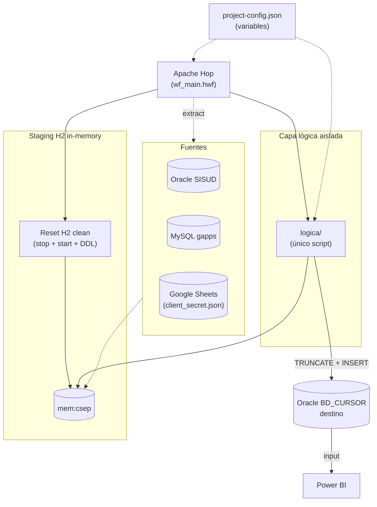

# Propuesta Adaptada — DWH OEFA sobre tu arquitectura real (Apache Hop + H2 + Python + Oracle BD_CURSOR)

**Evaluación de la efectividad de las estrategias de promoción del cumplimiento**
*(multas coercitivas)*

| | |
|---|---|
| **Referencia** | TDR REQ N.° 3629-2026 |
| **Área usuaria** | CSEP — DPEF / OEFA |
| **Origen de este documento** | Adaptación de `PROPUESTA_CONSOLIDADA.md` a la arquitectura ETL real ya definida en `arquitectura.md` |
| **Cambio respecto a la consolidada** | No se introduce SQL Server ni un motor nuevo; se reutilizan Apache Hop, H2 en memoria y Oracle BD_CURSOR tal como ya existen |
| **Alcance de este documento** | Planteamiento técnico y plan de implementación por fases (diseño conceptual, sin scripts ejecutables) |
| **Documentos complementarios** | `ddl/` (scripts de creación de tablas) · [`ANEXO_MAPEO_CAMPOS.md`](ANEXO_MAPEO_CAMPOS.md) (mapeo campo a campo fuente → modelo) |

---

## 0. Punto de partida: tu arquitectura actual

**División de responsabilidades (confirmada contigo):**

| Componente | Responsabilidad | Estado |
|---|---|---|
| **Apache Hop** (`wf_main.hwf`) | Orquesta el workflow: resetea H2, extrae las 3 fuentes hacia H2, invoca la capa lógica | Ya existe |
| **H2 en memoria** (`mem:csep`) | Staging transitorio, recreado limpio en cada corrida (sin persistencia entre ejecuciones) | Ya existe |
| **Capa lógica aislada** (H2 → BD_CURSOR) | Homologación, calidad de datos, modelo dimensional, KPIs, `TRUNCATE + INSERT` final | **Por desarrollar — este documento define su alcance** |
| **Oracle BD_CURSOR** | Único lugar donde vive el modelo dimensional final (hechos, dimensiones, indicadores) | Ya existe como destino |
| **Power BI** | Consumo directo de BD_CURSOR | Ya existe |
| **`project-config.json`** | Variables de conexión y parámetros | Ya existe |

**Decisión de lenguaje para la capa lógica: Python** (en vez de R), porque aún no hay nada
desarrollado ahí:

- Librerías maduras para exactamente este trabajo: `pandas` (transformación tabular),
  `jaydebeapi`/`sqlalchemy` (leer H2 vía JDBC), `oracledb` (escribir en BD_CURSOR), `openpyxl`
  si se necesita reabrir Excel, `gspread`/`google-api-python-client` para Google Sheets.
- Las propuestas técnicas más completas analizadas (ver sección 0.1 de la consolidada)
  coinciden independientemente en Python como motor de esta capa.
- Apache Hop invoca un script Python igual de bien que uno en R (step de ejecución de script/
  shell); no hay fricción de integración en ningún sentido.
- Mayor disponibilidad de soporte/talento a futuro si el proyecto cambia de responsable.

No se toca nada de lo que ya funciona (Hop, H2, extracción de fuentes, BD_CURSOR, Power BI,
`project-config.json`). Este documento define **solo** el contenido de la capa lógica que falta
construir.

---

## 1. Fuentes de datos (sin cambios respecto al diagnóstico ya validado)

| ID | Fuente | Motor / origen | Contenido |
|---|---|---|---|
| F1 | Excel "Medidas Administrativas OD Lambayeque" | Google Sheets (vía `client_secret.json`) | Tracking operativo de multas coercitivas (32 columnas) + catálogos (feriados, UBIGEO, parámetros) |
| F2 | Excel "CAGR Multas Coercitivas" | Google Sheets (vía `client_secret.json`) | Versión evolucionada del tracking (48 columnas) + etapas del workflow + diccionario de datos |
| F4 | `T_MVC_MULTACOERCITIVA_MC` | MySQL gapps | Tabla transaccional de la app de multas coercitivas |
| F5 | `VW_MULTA_COERCITIVA` | Oracle SISUD | Vista institucional consolidada de multas |

### Hallazgos de calidad ya confirmados

| # | Hallazgo | Tratamiento en la capa lógica |
|---|---|---|
| H1 | Nulos en campos clave / filas casi vacías (F4, F5) | Regla de completitud + tabla de rechazos en BD_CURSOR |
| H2 | CAM con 11 y 13 dígitos en la misma columna (F5) | Normalización a un formato único |
| H3 | Texto con saltos de línea embebidos (F5) | Limpieza de caracteres de control |
| H4 | Fechas heterogéneas: Oracle vs MySQL vs Sheets | Parseo único a `date` en Python |
| H5 | Lógica de negocio atrapada en fórmulas de Google Sheets (`WORKDAY.INTL`, `IMPORTRANGE`) | Migración a reglas Python documentadas |
| H6 | Catálogos con `IMPORTRANGE` roto (feriados, UBIGEO, parámetros, diccionario) | Solicitud a CSEP de exportación con valores + siembra de valores oficiales (UIT-MEF) como contingencia |
| H7 | Dos versiones del registro de multas (F1 32 col. vs F2 48 col.) | Una sola tabla integrada con columna `FUENTE_ORIGEN` |
| H8 | Estados como texto libre sin catálogo único | Tabla `MI_DIM_ESTADO` homologada y aprobada por CSEP |
| H9 | Claves de cruce sin correspondencia total entre fuentes | Tabla de equivalencias + % de amarre como métrica de calidad (no bloqueante) |

---

## 2. Qué hace Apache Hop (sin cambios) vs. qué hace la capa Python (nuevo)

| Etapa | Dónde vive | Detalle |
|---|---|---|
| Reset de H2 | **Hop** | `stop + start + DDL` de las tablas espejo en `mem:csep`, tal como ya está definido en `wf_main.hwf` |
| Extracción Oracle SISUD → H2 | **Hop** | Steps nativos de Hop (JDBC Oracle → H2) |
| Extracción MySQL gapps → H2 | **Hop** | Steps nativos de Hop (JDBC MySQL → H2) |
| Extracción Google Sheets → H2 | **Hop** | Step de Hop con `client_secret.json`, o delegado a un step de script si Hop no tiene conector nativo para Sheets |
| Invocación de la capa lógica | **Hop** | Step "Execute script" / "Shell" que llama al script Python, pasándole la conexión a H2 y a BD_CURSOR resueltas desde `project-config.json` |
| Perfilamiento, homologación, calidad, modelo dimensional, KPIs | **Python (nuevo)** | Todo el contenido de las secciones 3-6 de este documento |
| `TRUNCATE + INSERT` final a Oracle BD_CURSOR | **Python (nuevo)** | Al final del script, una vez validado el modelo dimensional en memoria/H2 |
| Consumo | **Power BI** | Sin cambios, apunta a BD_CURSOR |

Nada de lo anterior requiere modificar `wf_main.hwf` salvo agregar/ajustar el step que invoca el
script Python (reemplazando o complementando al `.R` actual).

---

## 3. Modelo dimensional (vive únicamente en Oracle BD_CURSOR)

Confirmado: H2 es solo staging transitorio (se descarta en cada corrida). El modelo dimensional
completo se calcula en Python y se materializa **únicamente** en Oracle BD_CURSOR mediante
`TRUNCATE + INSERT`. El DDL ejecutable de estas tablas está en `ddl/01_dimensiones.sql` y
`ddl/02_hechos.sql`; el mapeo campo a campo desde cada fuente está en
[`ANEXO_MAPEO_CAMPOS.md`](ANEXO_MAPEO_CAMPOS.md).

### 3.1 Tablas de hechos

| Tabla (en BD_CURSOR) | Grano | Notas |
|---|---|---|
| `MI_FACT_MULTA_COERCITIVA` | Una medida administrativa con su multa coercitiva, integrando F1+F2+F4+F5 | Hecho acumulativo: una sola fila recorre notificación → descargos → análisis → imposición → verificación → cobranza. Fechas de cada hito como columnas `DATE` directas |
| `MI_DET_ETAPA_MC` | Una etapa del workflow de elaboración de la multa (hoja "2) Etapas" de F2) | Tabla de detalle simple, no un segundo hecho dimensional — información operativa de apoyo |

### 3.2 Dimensiones

| Tabla (en BD_CURSOR) | Contenido | Actualización |
|---|---|---|
| `MI_DIM_TIEMPO` | Fecha, año, mes, trimestre, flag día hábil | Generada una vez, se reutiliza |
| `MI_DIM_ADMINISTRADO` | Código y razón social normalizada | `UPDATE` simple con marca de última actualización (sin SCD2) |
| `MI_DIM_ORGANO_UNIDAD` | Oficina/coordinación/dirección (ej. DSIS-CRES, DSEM-CMIN, ODES-MOQ) | ídem |
| `MI_DIM_MATERIA_SUBSECTOR` | Hidrocarburos, pesquería, minería, etc. | ídem |
| `MI_DIM_ESTADO` | Catálogo homologado de estados (resuelve H8) | ídem |
| `MI_DIM_PARAMETRO_UIT` | Año y valor UIT oficial (MEF) | Sembrada una vez, se actualiza al publicarse un nuevo valor |

**Sin SCD Tipo 2.** Un `UPDATE` con marca de última fecha de actualización es suficiente para
este alcance: las dimensiones de referencia rara vez cambian de nombre en el corto plazo del
proyecto.

### 3.3 Tabla de bitácora de calidad

| Tabla (en BD_CURSOR) | Contenido |
|---|---|
| `MI_DQ_HALLAZGO` | Regla, fuente, registro, campo, severidad, estado (pendiente/corregido/aceptado). Se materializa en BD_CURSOR (no solo en logs) para que CSEP la pueda auditar directamente desde Power BI si se desea |

---

## 4. Reglas de calidad (ejecutadas dentro del script Python, antes del INSERT final)

1. **Completitud** de campos clave (código de medida, expediente, CUM/CAM).
2. **Formato válido** de CUM/CAM (según patrón documentado en H2).
3. **Coherencia temporal** (fecha de vencimiento ≥ fecha de notificación, etc.).
4. **Montos UIT ≥ 0**.
5. **Coherencia UIT↔soles**: `MONTO_S = MULTA_UIT × UIT(año de la resolución)`, usando
   `MI_DIM_PARAMETRO_UIT` sembrada con valores oficiales del MEF.

Cada fila que no pasa una regla crítica se registra en `MI_DQ_HALLAZGO` y no bloquea el resto de la
carga (el `TRUNCATE + INSERT` continúa con las filas conformes; las no conformes quedan
documentadas para revisión de CSEP).

---

## 5. Indicadores (calculados en Python, persistidos en BD_CURSOR)

| # | Indicador | Definición |
|---|---|---|
| K1 | Cobertura | N.° de multas por año y órgano/unidad |
| K2 | Oportunidad del ciclo de multa | Días promedio entre notificación de descargos y firma de resolución |
| K3 | Efectividad de cobranza | Monto cobrado / monto impuesto (en UIT y soles) |
| K4 | Tasa de verificación post-multa | Multas con verificación posterior registrada / multas con resolución |
| K5 | Calidad del dato | % de registros conformes por regla de calidad |

Se calculan sobre el modelo dimensional ya cargado y se persisten en una tabla
`MI_INDICADOR_RESULTADO` en BD_CURSOR, para que Power BI los lea directo sin tener que recalcularlos
en el reporte.

---

## 6. Plan de implementación (secuencia técnica, sin cronograma de fechas)

Fases con dependencia estricta — no se avanza a la siguiente hasta cumplir el criterio de salida.

### Fase 1 — Preparar el entorno de la capa lógica

| | |
|---|---|
| **Entrada** | `wf_main.hwf` y `project-config.json` ya funcionando (extracción a H2) |
| **Tareas** | Crear el proyecto Python (entorno virtual, `pandas`/`jaydebeapi`/`oracledb`); leer variables de conexión (H2, BD_CURSOR) desde `project-config.json`; agregar/ajustar el step en Hop que invoque este script en lugar del `.R` |
| **Salida** | Script Python que se conecta a H2 y a BD_CURSOR usando la configuración existente |
| **Criterio de avance** | El script se ejecuta desde Hop y puede leer una tabla de H2 y escribir una fila de prueba en BD_CURSOR |

### Fase 2 — Perfilamiento y diccionario

| | |
|---|---|
| **Entrada** | H2 poblado por Hop (Fase 1 de tu pipeline actual) |
| **Tareas** | Perfilar cada tabla de H2 (nulos, duplicados, formatos, dominios); reconstruir el diccionario de campos a partir de `DIC_TABLAS`/`DIC_VARIABLES`; documentar los 9 hallazgos con evidencia del ambiente real |
| **Salida** | Reporte de perfilamiento + diccionario de datos |
| **Criterio de avance** | Todo campo de las 5 fuentes está documentado |

### Fase 3 — Homologación e integración

| | |
|---|---|
| **Entrada** | Diccionario completo (Fase 2) |
| **Tareas** | Normalizar CUM/CAM; parsear fechas heterogéneas; limpiar texto (saltos de línea, tokens de error); integrar F1+F2+F4+F5 en un dataframe único de multas con columna `FUENTE_ORIGEN`; homologar estados (aprobado por CSEP) |
| **Salida** | Dataframes integrados y tipificados, en memoria de Python |
| **Criterio de avance** | Cero errores de tipo al procesar cada dataframe; catálogo de estados aprobado |

### Fase 4 — Reglas de calidad

| | |
|---|---|
| **Entrada** | Dataframes integrados (Fase 3) |
| **Tareas** | Ejecutar las 5 reglas de calidad (sección 4); separar filas conformes de las que van a `MI_DQ_HALLAZGO`; calcular el % de amarre entre fuentes (H9) |
| **Salida** | Dataframes validados + registros de hallazgos listos para insertar |
| **Criterio de avance** | Las 5 reglas se ejecutan sin error; hallazgos críticos tienen tratamiento definido |

### Fase 5 — Construcción del modelo dimensional

| | |
|---|---|
| **Entrada** | Dataframes validados (Fase 4) |
| **Tareas** | Construir en memoria las dimensiones (`MI_DIM_TIEMPO`, `MI_DIM_ADMINISTRADO`, `MI_DIM_ORGANO_UNIDAD`, `MI_DIM_MATERIA_SUBSECTOR`, `MI_DIM_ESTADO`, `MI_DIM_PARAMETRO_UIT`) y los hechos (`MI_FACT_MULTA_COERCITIVA`, `MI_DET_ETAPA_MC`) |
| **Salida** | Estructuras finales listas para cargar |
| **Criterio de avance** | Ningún hecho queda sin dimensión (uso de un miembro "NO ESPECIFICADO") |

### Fase 6 — Carga a Oracle BD_CURSOR

| | |
|---|---|
| **Entrada** | Modelo dimensional construido (Fase 5) |
| **Tareas** | `TRUNCATE + INSERT` de dimensiones, luego hechos, luego `MI_DQ_HALLAZGO`, siguiendo el mismo patrón que ya usa tu capa lógica actual |
| **Salida** | BD_CURSOR actualizado con el modelo completo |
| **Criterio de avance** | Conteos en BD_CURSOR coinciden con los dataframes de origen |

### Fase 7 — Indicadores

| | |
|---|---|
| **Entrada** | BD_CURSOR cargado (Fase 6) |
| **Tareas** | Calcular K1-K5; insertar en `MI_INDICADOR_RESULTADO` |
| **Salida** | Indicadores persistidos y reproducibles |
| **Criterio de avance** | Recalcular sobre el mismo insumo produce el mismo resultado |

### Fase 8 — Verificación en Power BI

> **Fuera de alcance en esta implementación** (no se realizará en este repo).

| | |
|---|---|
| **Entrada** | Indicadores persistidos |
| **Tareas** | Conectar/actualizar el `.pbix` existente contra las nuevas tablas de BD_CURSOR; validar filtros por año, órgano/unidad y materia/subsector |
| **Salida** | Tablero actualizado |
| **Criterio de avance** | El tablero refleja los datos de la última corrida sin ajustes manuales |

### Fase 9 — Documentación de entrega

| | |
|---|---|
| **Entrada** | Todo lo anterior construido y probado |
| **Tareas** | Diccionario final, matriz de correspondencia fuente→H2→BD_CURSOR→indicador, comentarios en el propio script Python, bitácora de hallazgos |
| **Salida** | Paquete de documentación técnica |
| **Criterio de avance** | Otra persona puede reproducir una corrida completa siguiendo solo la documentación y el código |

---

## 7. Riesgos específicos de esta arquitectura

| Riesgo | Impacto | Mitigación |
|---|---|---|
| H2 en memoria se queda sin espacio si el volumen crece | Bajo (volúmenes actuales son pequeños) | Monitorear tamaño de las tablas espejo; si crece, evaluar H2 en modo archivo en vez de memoria |
| Falla de credenciales de Google Sheets (`client_secret.json` expirado/revocado) | Medio | Documentar el procedimiento de renovación de credenciales como parte de la Fase 1 |
| Catálogos con `IMPORTRANGE` roto (H6) | Medio | Solicitar a CSEP la exportación con valores antes de la Fase 3; sembrar `MI_DIM_PARAMETRO_UIT` con valores oficiales del MEF como contingencia |
| Falta de llave única entre fuentes de multa (H9) | Medio | Tabla de equivalencias + % de amarre reportado como métrica de calidad (K5), no bloqueante |
| Doble versión del registro de multas (F1 vs F2, H7) | Bajo | Una sola tabla integrada con `FUENTE_ORIGEN` siempre visible |

---

## 8. Criterios de aceptación

1. El step de Hop invoca correctamente el script Python (reemplazando o complementando al `.R`).
2. Las 5 reglas de calidad se ejecutan en cada corrida y sus hallazgos quedan en `MI_DQ_HALLAZGO`
   dentro de BD_CURSOR.
3. El diccionario de datos y las homologaciones de estado están aprobados por CSEP.
4. Los indicadores K1-K5 son reproducibles: misma corrida de H2 produce el mismo resultado en
   BD_CURSOR.
5. El tablero Power BI existente sigue funcionando apuntando a las tablas actualizadas de
   BD_CURSOR, sin cambios de configuración manual.
6. `project-config.json` centraliza toda la configuración de conexión (H2, BD_CURSOR, Sheets);
   no hay credenciales ni rutas embebidas directamente en el script Python.

---

## 9. Lo que no cambia de tu arquitectura actual

- Apache Hop sigue siendo el único orquestador (`wf_main.hwf`).
- H2 en memoria sigue siendo staging transitorio, reseteado en cada corrida.
- Oracle BD_CURSOR sigue siendo el único destino final, cargado por `TRUNCATE + INSERT`.
- Power BI sigue consumiendo directo de BD_CURSOR.
- `project-config.json` sigue siendo la única fuente de variables de configuración.

Lo único que se agrega es el **contenido** de la capa lógica (hoy vacía en la práctica), escrito
en Python en vez de R, con el alcance de homologación, calidad, modelo dimensional e indicadores
definido en las secciones 3-6.

---

*Documento de planteamiento y plan de implementación por fases, adaptado a la arquitectura ETL
real (Apache Hop + H2 + Python + Oracle BD_CURSOR). No incluye scripts ejecutables — el desarrollo
del script Python de la capa lógica se realiza siguiendo la secuencia de la sección 6.*
