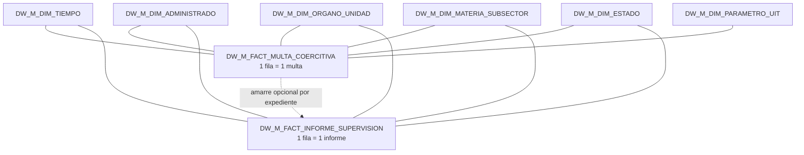
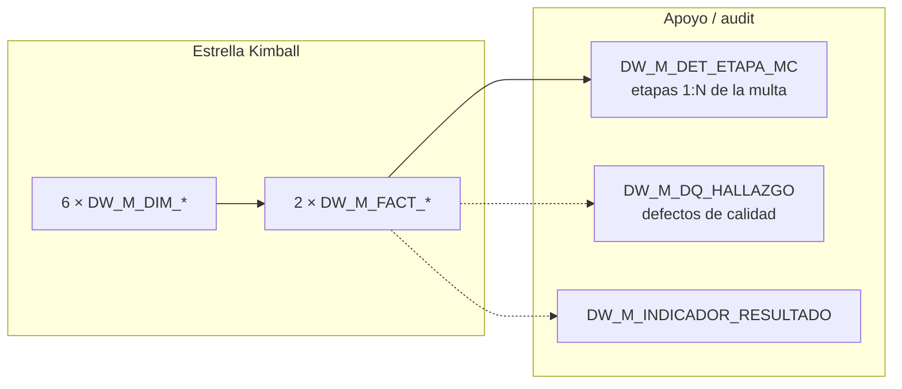

# Modelo Kimball (Oracle DW)

Estrella dimensional que vive en Oracle (`DB_ORA_DW_*` en [`environments/remote.json`](../environments/remote.json)).  
Flujo ETL: [`arquitectura.md`](arquitectura.md) · inputs: [`inputs/README.md`](inputs/README.md). Mapeo campos: [`lineamientos/ANEXO_MAPEO_CAMPOS.md`](lineamientos/ANEXO_MAPEO_CAMPOS.md).

## Estrella

Centro = **hechos**. Puntas = **dimensiones** (FK desde el hecho). Dos hechos comparten el mismo juego de dimensiones.



| Rol | Tablas |
|---|---|
| **Hechos** | `DW_M_FACT_MULTA_COERCITIVA`, `DW_M_FACT_INFORME_SUPERVISION` |
| **Dimensiones** | `TIEMPO`, `ADMINISTRADO`, `ORGANO_UNIDAD`, `MATERIA_SUBSECTOR`, `ESTADO`, `PARAMETRO_UIT` |

Power BI corta por dimensión (órgano, materia, estado…) y agrega medidas del hecho.

## Fuera de la estrella (apoyo)

Estas tablas **no son dimensiones ni hechos Kimball**. Se cargan junto al modelo porque el entregable es auditable.

### `DW_M_DET_ETAPA_MC` — detalle del workflow de la multa

**Para qué:** guardar cada **etapa** del ciclo de elaboración de una multa (cálculo → elaboración → revisión → firma…), tal como viene en la hoja `2) Etapas` del Excel F2.

**Relación:** muchas etapas → una multa (`ID_MC` / `COD_PROY_MC` apunta al hecho padre).

```text
DW_M_FACT_MULTA_COERCITIVA  1 ─── N  DW_M_DET_ETAPA_MC
```

No es un tercer hecho dimensional: no se analiza sola en Power BI como grano analítico; sirve para ver **en qué paso está** o estuvo cada multa.

### `DW_M_DQ_HALLAZGO` — bitácora de calidad

**Para qué:** registrar **qué regla falló**, en **qué registro/campo**, con severidad. Es el log auditable de las reglas R01–R05 (completitud, formato CUM/CAM, fechas, montos UIT, coherencia UIT↔soles).

**No reemplaza al hecho:** la fila defectuosa **sigue** en `DW_M_FACT_*` (cuarentena blanda, marcada con `FG_CONFORME`). El hallazgo vive aquí para que CSEP revise en Power BI / SQL sin mirar logs de corrida.

```text
Regla R0x falla en una fila
        ↓
  DW_M_FACT_*  (fila permanece, marcada)
  DW_M_DQ_HALLAZGO  (se agrega 1+ filas de hallazgo)
```

### `DW_M_INDICADOR_RESULTADO` — KPIs precalculados

K1–K5 ya resueltos en Python para lectura directa (no son parte del esquema estrella; son resultado sobre el modelo).

## Resumen visual


