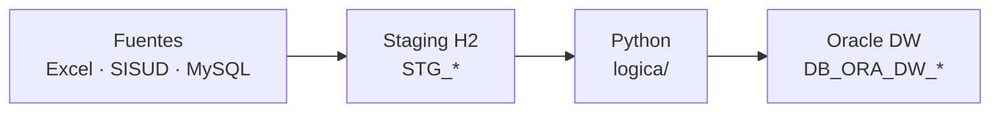

# Vista general — flujo ETL

Mapa corto: fuentes → staging → Python → Oracle DW.  
Modelo dimensional: [`modelo-kimball.md`](modelo-kimball.md). Detalle técnico: [`arquitectura.md`](arquitectura.md).

Entorno: [`environments/remote.json`](../environments/remote.json) (o `local.json`) vía `./switch-env.sh`. Destino: `DB_ORA_DW_*`.

Orquestación: `wf_main` → Reset H2 → `create_stg.py` → `pl_stage_*` → `python/main.py` → `cargar_dw.py`.

| Capa | Rol |
|---|---|
| **Fuentes** | Excel, Oracle SISUD, MySQL GAPP |
| **STG** | Espejo 1:1 en H2 (Hop) |
| **Python** | Homologación, Kimball, DQ, KPIs |
| **Oracle DW** | Persistencia del modelo (`TRUNCATE+INSERT`) |
