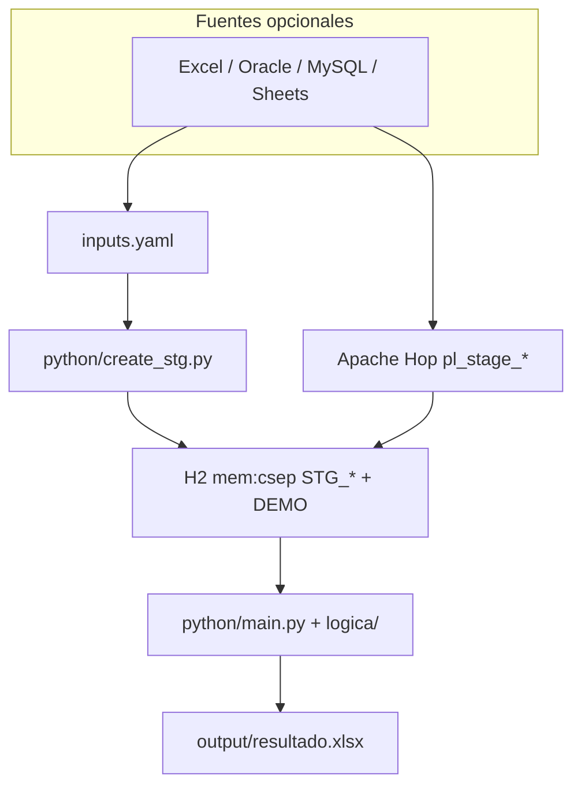

# Arquitectura — arquetipo mínimo

ETL **Apache Hop + H2 in-memory + Python**. Demo: `DEMO_TABLA_EJEMPLO` → `logica/demo.py` → Excel.

## Vista general

| Capa | Responsabilidad |
|---|---|
| `inputs.yaml` | Declara fuentes → tablas `STG_*` |
| `create_stg.py` | DDL H2 (sin filas) |
| Hop | Extract → H2 |
| `logica/` | Reglas de negocio (un `.py`) |
| H2 | Staging efímero (reset cada corrida) |

## Workflows

| Workflow | Uso |
|---|---|
| `wf_create_stg.hwf` | Diseño: deja H2 vivo para mapear pipelines |
| `wf_main.hwf` | Corrida demo: Reset → STG → pl_demo → Python |

## Extender

Ver [`README.md`](../README.md) y skill [`.agents/skills/hop-python-etl/`](../.agents/skills/hop-python-etl/SKILL.md).

Para consultoría OEFA (DW, indicadores): copiar módulos desde repo `etl_phyton_cursor`.
